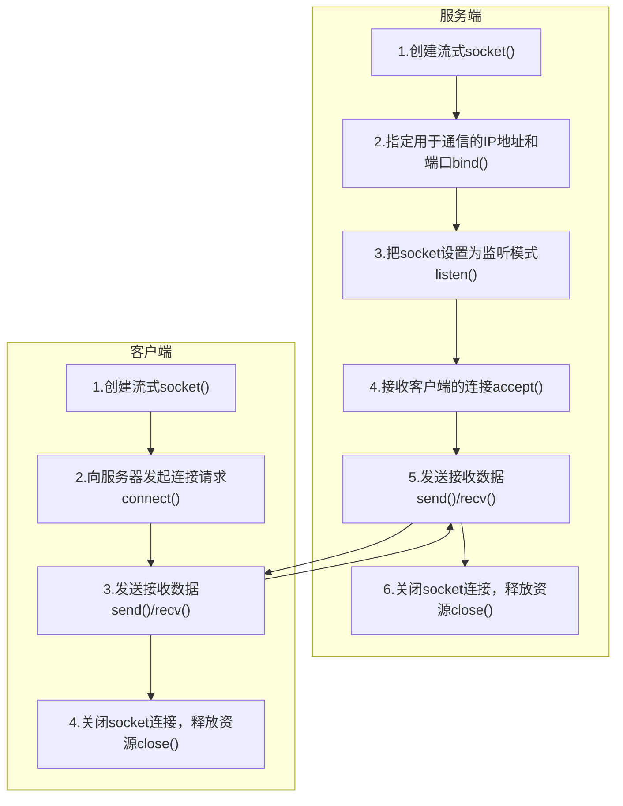
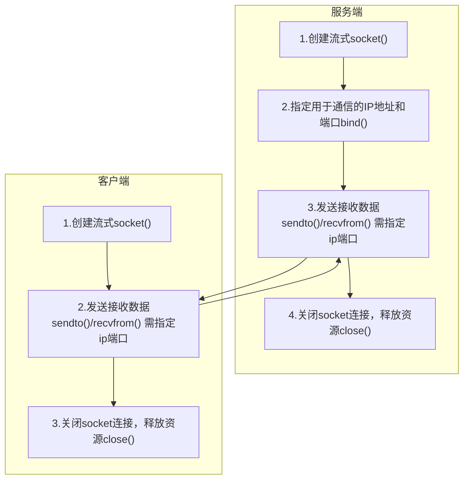

Linux

# 一、简单命令行

[Linux命令在线速查手册 - W3xue.com](https://www.w3xue.com/manual/linux/)

[Linux 命令大全 | 菜鸟教程 (runoob.com)](https://www.runoob.com/linux/linux-command-manual.html)

## 1、文件与目录操作

### （1） `ls` - 列出目录内容

- **语法**：`ls [选项] [目录或文件]`
- **选项：**
  - -a 显示所有文件及目录 (ls内定将文件名或目录名称开头为"."的视为隐藏档，不会列出)
  - -l 除文件名称外，亦将文件型态、权限、拥有者、文件大小等资讯详细列出
  - -r 将文件以相反次序显示(原定依英文字母次序)
  - -t 将文件依建立时间之先后次序列出
  - -A 同 -a ，但不列出 "." (目前目录) 及 ".." (父目录)
  - -F 在列出的文件名称后加一符号；例如可执行档则加 "*", 目录则加 "/"
  - -R 若目录下有文件，则以下之文件亦皆依序列出

- **示例：**

```bash
ls  		#列出当前目录内容（不显示隐藏文件）

ls -a 		#显示所有文件，包括以 . 开头的隐藏文件

ls -l		#长格式显示，可以看到权限、所有者、大小、时间等详细信息。

ls -lh		#-h 以人类易读的格式显示文件大小（如 K, M, G），配合 -l 使用

ls /home	# - 列出指定目录的内容。
```

**注意：**`-l` 显示的第一个字符表示文件类型：`-` 普通文件，`d` 目录，`l` 链接文件。

```bash
total 69K
drwxr-xr-x 1 CXQ 197121    0 10月  5 18:38 ./
drwxr-xr-x 1 CXQ 197121    0 10月  5 19:16 ../
drwxr-xr-x 1 CXQ 197121    0 10月  5 19:14 .git/       
-rw-r--r-- 1 CXQ 197121  442  9月 22 17:13 .gitignore  
drwxr-xr-x 1 CXQ 197121    0  9月 22 16:30 .vscode/    
drwxr-xr-x 1 CXQ 197121    0  9月 29 02:27 include/    
drwxr-xr-x 1 CXQ 197121    0  9月 22 14:48 lib/        
-rw-r--r-- 1 CXQ 197121 2.4K  9月 29 03:30 Makefile    
drwxr-xr-x 1 CXQ 197121    0  9月 29 02:45 output/     
-rw-r--r-- 1 CXQ 197121 2.4K 10月  5 19:13 README.en.md
-rw-r--r-- 1 CXQ 197121 2.2K 10月  5 23:39 README.md
drwxr-xr-x 1 CXQ 197121    0  9月 29 02:45 src/
```

### （2）`cd` - 切换目录

*   **语法**：`cd [目录路径]`

*   **示例**：

```bash
cd /home/user  	#切换到绝对路径,即user所在路径

cd Documents	#切换到当前目录下的相对路径，前提当前目录有该文件

cd ..  			#切换到上级目录（一个点表示当前目录，两个点表示上级目录）

cd ~ 
cd              #切换到当前用户的home目录。

cd - 			#切换到上一个所在的目录	
```

**注意：**路径有空格或特殊字符时，要用引号括起来，如 `cd "my documents"`。

### （3）`pwd` - 显示当前目录

```bash
pwd #输出类似 `/home/username` 的绝对路径
```

### （4）`mkdir` - 创建目录

*   **语法**：`mkdir [选项] 目录名...`
*   **选项：**
    - -p 确保目录名称存在，不存在的就建一个。
*   **示例**：

```bash
mkdir new_folder 					#创建单个目录

mkdir -p parent/child/grandchild 	#递归创建多级目录，如果父目录不存在也会一并创建，不加 `-p` 参数时，如果父目录不存在，创建会失败
```

### （5）`rmdir` - 删除空目录

*   **语法**：`rmdir 目录名...`
*   **示例**：

```bash
rmdir empty_folder 		# - 删除一个空目录
```

**注意：**只能删除**空目录**，有内容的目录需要用 `rm -r`。

### （6）`cp` - 复制文件或目录

*   **语法**：`cp [选项] 源文件 目标文件`
*   **选项：**
    - -a：此选项通常在复制目录时使用，它保留链接、文件属性，并复制目录下的所有内容。其作用等于dpR参数组合。
    - -d：复制时保留链接。这里所说的链接相当于Windows系统中的快捷方式。
    - -f：覆盖已经存在的目标文件而不给出提示。
    - -i：与-f选项相反，在覆盖目标文件之前给出提示，要求用户确认是否覆盖，回答"y"时目标文件将被覆盖。
    - -p：除复制文件的内容外，还把修改时间和访问权限也复制到新文件中。
    - -r：若给出的源文件是一个目录文件，此时将复制该目录下所有的子目录和文件。
    - -l：不复制文件，只是生成链接文件。
*   **示例**：

```bash
cp file1.txt file2.txt	#将 `file1.txt` 复制为 `file2.txt`

cp file1.txt /tmp/		#将文件复制到 `/tmp` 目录下

cp -r dir1 dir2			#递归复制整个目录。复制目录必须加 `-r` 选项

cp -i file1.txt /tmp/	#`-i` 在覆盖前会提示确认，非常安全

```

### （7）`mv` - 移动或重命名文件/目录

*   **语法**：`mv [选项] 源文件 目标文件`
*   **选项：**
    - -i: 若指定目录已有同名文件，则先询问是否覆盖旧文件;
    - -f: 在mv操作要覆盖某已有的目标文件时不给任何指示;
*   **示例**：

```bash
mv old_name.txt new_name.txt		# 重命名文件

mv file1.txt /home/user/Documents/	#移动文件到另一个目录

mv -i file1.txt /tmp/				# 移动时，如果目标存在则提示确认

```

**注意：**不需要 `-r` 选项来移动目录。

### （8）`rm` - 删除文件或目录

*   **语法**：`rm [选项] 文件或目录...`
*   **选项：**
    - -i 删除前逐一询问确认。
    - -f 即使原档案属性设为唯读，亦直接删除，无需逐一确认。
    - -r 将目录及以下之档案亦逐一删除。
*   **示例**：

```bash
rm useless_file.txt			# 删除文件

rm -r useless_directory		# 递归删除目录及其内部所有内容

rm -f stubborn_file			# `-f` 强制删除，忽略不存在的文件，不提示

rm -i important_file		# 交互式删除，每次都会询问确认

```

**注意：**

- 删除目录必须加 `-r` 选项

- **`rm -rf /` 或 `rm -rf *` 是极其危险的命令，可能导致系统被毁或数据丢失，永远不要尝试！**

## 2、文件内容查看与编辑

### （1）`cat` - 连接文件并打印到标准输出

* **语法**：`cat [选项] [文件]...`

* **选项：**

  - **-n 或 --number**：由 1 开始对所有输出的行数编号。

    **-b 或 --number-nonblank**：和 -n 相似，只不过对于空白行不编号。

    **-s 或 --squeeze-blank**：当遇到有连续两行以上的空白行，就代换为一行的空白行。

    **-v 或 --show-nonprinting**：使用 ^ 和 M- 符号，除了 LFD 和 TAB 之外。

    **-E 或 --show-ends** : 在每行结束处显示 $。

    **-T 或 --show-tabs**: 将 TAB 字符显示为 ^I。

    **-e** : 等价于 -vE。

    **-A, --show-all**：等价于 -vET。

    **-e：**等价于"-vE"选项；

    **-t：**等价于"-vT"选项；

* **示例**：

  ```bash
  cat file.txt			# 查看整个文件内容。
  cat file1.txt file2.txt	# 依次显示多个文件的内容。
  cat > new_file.txt		# 从键盘输入创建新文件，按 `Ctrl + D` 结束。
  ```

*   **注意点**：适合查看**内容较少**的文件，内容多会刷屏。

### （2）`less` / `more` - 分页显示文件内容

*   **语法**：`less 文件名` （推荐使用 `less`，功能更强）
*   **示例**

```bash
less /var/log/syslog #分页查看系统日志
```

*   **操作键**：
    *   空格键 - 向下翻一页。
    *   `b` - 向上翻一页。
    *   `/关键词` - 向下搜索。
    *   `?关键词` - 向上搜索。
    *   `q` - 退出。

### （3）`head` / `tail` - 显示文件开头/结尾

*   **语法**：`head/tail [选项] 文件`
*   **选项：**
    - -q 隐藏文件名
    - -v 显示文件名
    - -c<数目> 显示的字节数。
    - -n<行数> 显示的行数。
*   **示例**

```bash
head -n 20 file.log				# 显示文件前 20 行
tail -n 10 file.log				#显示文件末尾 10 行
tail -f /var/log/app.log		# 实时追踪文件末尾的新增内容，用于监控日志，按 `Ctrl + C` 退出
```

### (4)`grep` - 文本搜索工具

- **语法：`grep [选项] "str" [文件...]`**

- **选项：**

  **常用：**

  - `-i`：忽略大小写进行匹配。
  - `-v`：反向查找，只打印不匹配的行。
  - `-n`：显示匹配行的行号。
  - `-r`：递归查找子目录中的文件。
  - `-l`：只打印匹配的文件名。
  - `-c`：只打印匹配的行数。

  **更多参数说明**：

  - **-a 或 --text** : 不要忽略二进制的数据。
  - **-A<显示行数> 或 --after-context=<显示行数>** : 除了显示符合范本样式的那一列之外，并显示该行之后的内容。
  - **-b 或 --byte-offset** : 在显示符合样式的那一行之前，标示出该行第一个字符的编号。
  - **-B<显示行数> 或 --before-context=<显示行数>** : 除了显示符合样式的那一行之外，并显示该行之前的内容。
  - **-c 或 --count** : 计算符合样式的列数。
  - **-C<显示行数> 或 --context=<显示行数>或-<显示行数>** : 除了显示符合样式的那一行之外，并显示该行之前后的内容。
  - **-d <动作> 或 --directories=<动作>** : 当指定要查找的是目录而非文件时，必须使用这项参数，否则grep指令将回报信息并停止动作。
  - **-e<范本样式> 或 --regexp=<范本样式>** : 指定字符串做为查找文件内容的样式。
  - **-E 或 --extended-regexp** : 将样式为延伸的正则表达式来使用。
  - **-f<规则文件> 或 --file=<规则文件>** : 指定规则文件，其内容含有一个或多个规则样式，让grep查找符合规则条件的文件内容，格式为每行一个规则样式。
  - **-F 或 --fixed-regexp** : 将样式视为固定字符串的列表。
  - **-G 或 --basic-regexp** : 将样式视为普通的表示法来使用。
  - **-h 或 --no-filename** : 在显示符合样式的那一行之前，不标示该行所属的文件名称。
  - **-H 或 --with-filename** : 在显示符合样式的那一行之前，表示该行所属的文件名称。
  - **-i 或 --ignore-case** : 忽略字符大小写的差别。
  - **-l 或 --file-with-matches** : 列出文件内容符合指定的样式的文件名称。
  - **-L 或 --files-without-match** : 列出文件内容不符合指定的样式的文件名称。
  - **-n 或 --line-number** : 在显示符合样式的那一行之前，标示出该行的列数编号。
  - **-o 或 --only-matching** : 只显示匹配PATTERN 部分。
  - **-q 或 --quiet或--silent** : 不显示任何信息。
  - **-r 或 --recursive** : 此参数的效果和指定"-d recurse"参数相同。
  - **-s 或 --no-messages** : 不显示错误信息。
  - **-v 或 --invert-match** : 显示不包含匹配文本的所有行。
  - **-V 或 --version** : 显示版本信息。
  - **-w 或 --word-regexp** : 只显示全字符合的列。
  - **-x --line-regexp** : 只显示全列符合的列。
  - **-y** : 此参数的效果和指定"-i"参数相同。

- **示例：**

```bash
# 基础搜索：在文件中查找包含"error"的行
grep "error" /var/log/syslog

# 忽略大小写
grep -i "warning" app.log

# 显示不匹配的行（反向选择）
grep -v "success" results.txt

# 显示行号
grep -n "function" script.js

# 递归搜索目录中的文件
grep -r "TODO" /path/to/code/

# 只显示匹配的文件名，不显示具体内容
grep -l "deprecated" *.py

# 统计匹配的行数
grep -c "404" access.log

# 使用扩展正则表达式（支持 +, ?, | 等）
grep -E "foo|bar" file.txt

# 查找以"abc"开头的行
grep "^abc" file.txt

# 查找以"xyz"结尾的行
grep "xyz$" file.txt

#---------高级用法-----------
# 结合管道使用：查找特定进程
ps aux | grep nginx

# 查找包含A但不包含B的行
grep "patternA" file.txt | grep -v "patternB"

# 显示匹配行的前后内容
grep -A 3 -B 2 "critical error" logfile  # 显示匹配行及前后3行、2行
```

### (5)`sed` - 流编辑器

- **语法：**`sed [选项] '命令' [输入文件]`
- **选项：**
  - -e<script>或--expression=<script> 以选项中指定的script来处理输入的文本文件。
  - -f<script文件>或--file=<script文件> 以选项中指定的script文件来处理输入的文本文件。
  - -h或--help 显示帮助。
  - -n或--quiet或--silent 仅显示script处理后的结果。
  - -V或--version 显示版本信息。
- **命令：**
  - a ：新增， a 的后面可以接字串，而这些字串会在新的一行出现(目前的下一行)～
  - c ：取代， c 的后面可以接字串，这些字串可以取代 n1,n2 之间的行！
  - d ：删除，因为是删除啊，所以 d 后面通常不接任何东东；
  - i ：插入， i 的后面可以接字串，而这些字串会在新的一行出现(目前的上一行)；
  - p ：打印，亦即将某个选择的数据印出。通常 p 会与参数 sed -n 一起运行～
  - s ：取代，可以直接进行取代的工作哩！通常这个 s 的动作可以搭配正则表达式！例如 1,20s/old/new/g 就是啦！
- **示例：**

```bash
# 替换操作：s/原模式/新模式/标志
sed 's/foo/bar/g' file.txt          # 将所有foo替换为bar
sed 's/foo/bar/' file.txt           # 只替换每行的第一个foo
sed 's/foo/bar/2' file.txt          # 只替换每行的第二个foo

# 直接修改原文件（危险但常用）
sed -i 's/old/new/g' file.txt

# 备份原文件并修改
sed -i.bak 's/old/new/g' file.txt

# 删除操作
sed '3d' file.txt                   # 删除第3行
sed '1,5d' file.txt                 # 删除1-5行
sed '/pattern/d' file.txt           # 删除匹配pattern的行

# 打印特定行
sed -n '10p' file.txt               # 只打印第10行
sed -n '10,20p' file.txt            # 打印10-20行

# 多重操作
sed -e 's/foo/bar/g' -e 's/hello/world/g' file.txt

# 在行前/行后插入文本
sed '2i\插入的行' file.txt           # 在第2行前插入
sed '2a\追加的行' file.txt           # 在第2行后追加
```

### (6)`awk` - 文本处理语言

- **语法：**`awk  [选项]  '模式 { 动作 }'  输入文件`

- **选项：**

  - `-F <分隔符>` 或 `--field-separator=<分隔符>`： 指定输入字段的分隔符，默认是空格。使用这个选项可以指定不同于默认分隔符的字段分隔符。
  - `-v <变量名>=<值>`： 设置 `awk` 内部的变量值。可以使用该选项将外部值传递给 `awk` 脚本中的变量。
  - `-f <脚本文件>`： 指定一个包含 `awk` 脚本的文件。这样可以在文件中编写较大的 `awk` 脚本，然后通过 `-f` 选项将其加载。

- **基本结构：**

  awk程序通常由三部分组成：BEGIN块、主体块、END块

  - `BEGIN`：在处理任何输入之前执行

  - `主体`：对每一行输入执行

  - `END`：在处理完所有输入后执行

  - ```bash
    awk 'BEGIN { print "开始处理文件" } 
         { print "处理行:", $0 } 
         END { print "处理结束" }' file.txt
    ```

- **内置变量:**

  - `$0`：整行内容
  - `$1, $2, ...`：第1、第2个字段
  - `NF`：当前行的字段数量
  - `NR`：当前行号
  - `FS`：输入字段分隔符
  - `OFS`：输出字段分隔符

- **示例：**

```bash
# 打印特定字段
awk '{print $1, $3}' file.txt               # 打印每行的第1和第3个字段

# 指定分隔符
awk -F: '{print $1, $6}' /etc/passwd        # 以冒号分隔，打印用户名和家目录

# 条件处理
awk '$3 > 100 {print $0}' data.txt          # 第3个字段大于100的行
awk '/error/ {print NR, $0}' logfile        # 包含error的行，带行号

# 使用BEGIN和END
awk 'BEGIN {sum=0} {sum+=$1} END {print "总和:", sum}' numbers.txt

# 统计行数、单词数、字符数（模拟wc）
awk '{chars+=length($0)+1; words+=NF} END {print NR, words, chars}' file.txt

# 字段计算
awk '{print $1, $2, $2*1.1}' prices.txt     # 第2个字段乘以1.1

# 数组使用（统计IP访问次数）
awk '{ip_count[$1]++} END {for(ip in ip_count) print ip, ip_count[ip]}' access.log
```

**注意：**`awk` 功能极其强大，可以完成复杂的文本处理和计算任务，绝非简单就能介绍完的，需要读者另深入学习

### (7)`find` - 文件查找

- **语法**：`find [路径...] [匹配条件][测试条件]`
- **匹配条件：**
  - `-name pattern`：按文件名查找，支持使用通配符 `*` 和 `?`。
  - `-type type`：按文件类型查找，可以是 `f`（普通文件）、`d`（目录）、`l`（符号链接）等。
  - `-size [+-]size[cwbkMG]`：按文件大小查找，支持使用 `+` 或 `-` 表示大于或小于指定大小，单位可以是 `c`（字节）、`w`（字数）、`b`（块数）、`k`（KB）、`M`（MB）或 `G`（GB）。
  - `-mtime days`：按修改时间查找，支持使用 `+` 或 `-` 表示在指定天数前或后，days 是一个整数表示天数。
  - `-user username`：按文件所有者查找。
  - `-group groupname`：按文件所属组查找。
- **测试条件：**
  - `-amin n`：查找在 n 分钟内被访问过的文件。
  - `-atime n`：查找在 n*24 小时内被访问过的文件。
  - `-cmin n`：查找在 n 分钟内状态发生变化的文件（例如权限）。
  - `-ctime n`：查找在 n*24 小时内状态发生变化的文件（例如权限）。
  - `-mmin n`：查找在 n 分钟内被修改过的文件。
  - `-mtime n`：查找在 n*24 小时内被修改过的文件。
  - 关于n
    - **+n**：查找比 n 天前更早的文件或目录。
    - **-n**：查找在 n 天内更改过属性的文件或目录。
    - **n**：查找在 n 天前（指定那一天）更改过属性的文件或目录。
- **示例：**

```bash
# 按名称查找
find /home -name "*.txt"                    # 查找所有.txt文件
find . -iname "readme*"                     # 忽略大小写

# 按类型查找
find /var -type f -name "*.log"             # 只找普通文件
find /tmp -type d                           # 只找目录

# 按时间查找
find . -mtime -7                           # 7天内修改过的文件
find /var/log -mmin -60                    # 60分钟内修改过的文件

# 按大小查找
find /home -size +100M                     # 大于100MB的文件
find . -size -1k                           # 小于1KB的文件

# 按权限查找
find /etc -perm 644                        # 权限精确为644的文件
find . -perm /u=x                          # 用户有执行权限的文件

# 组合条件
find /var -name "*.log" -type f -size +1G  # 查找大于1G的日志文件

# 对找到的文件执行操作
find /tmp -name "*.tmp" -delete            # 删除所有临时文件
find . -name "*.js" -exec chmod 644 {} \;  # 修改JS文件权限
find /var/log -name "*.log" -exec cp {} /backup/ \;  # 备份日志文件
```

### (8)`locate` - 快速文件查找

- **语法：**`locate [选项] 文本`
- **选项：**
  - `-b, --basename`：仅搜索路径名的文件名部分
  - `-c, --count`：打印匹配项的数量而非匹配内容
  - `-d, --database DBPATH`：搜索 DBPATH 中的文件（默认路径为 /var/lib/plocate/plocate.db）
  - `-i, --ignore-case`：不区分大小写进行搜索
  - `-l, --limit LIMIT`：找到 LIMIT 个匹配项后停止
  - `-0, --null`：用 NUL 而非换行符分隔匹配的文件
  - `-N, --literal`：即使输出到终端，也不对文件名加引号
  - `-r, --regexp`：将模式解释为基本正则表达式（速度较慢）
  - `--regex`：将模式解释为扩展正则表达式（速度较慢）
  - `-w, --wholename`：搜索整个路径名（默认行为；参见 -b）
- **示例：**

```bash
# 基础查找
locate passwd                              # 查找所有包含passwd的文件路径

# 限制结果数量
locate -l 10 "*.conf"                      # 只显示前10个结果

# 忽略大小写
locate -i "readme"


# 使用正则表达式
locate -r "\.log$"                         # 以.log结尾的文件
```

## 3、权限管理

### （1）`sudo` - 以超级用户身份执行命令

临时获取 root 权限来执行**一条特定命令**，而无需切换到 root 用户

- **语法**：`sudo [选项] 命令`

- **选项**：

  - **-i**: 模拟初始登录，加载目标用户的环境
  - **-s**: 运行shell
  - **-u** user: 以指定用户身份运行
  - **-l**: 列出当前用户可执行的sudo命令
  - **-v**: 验证用户凭据（延长sudo会话）
  - **-k**: 撤销sudo凭据缓存

- **示例**

  ```bash
  # 更新软件包列表（需要 root 权限）
  sudo apt update
  
  # 编辑一个系统配置文件
  sudo vim /etc/hosts
  
  # 以另一个用户身份执行命令（例如用户 alice）
  sudo -u alice whoami
  
  # 切换到 root 用户（不推荐长期使用，但有时需要）
  sudo -i
  ```

### （2） `su` - 切换用户

切换到另一个用户身份，并启动一个新的 **Shell 会话**。

- **语法**：`su [选项] [用户名]`

- **选项**：

  - `-` 或 `-l` 或 `--login`: 提供类似直接登录的环境
  - `-c command`: 执行指定命令后退出
  - `-s shell`: 指定要使用的shell
  - `-p` 或 `--preserve-environment`: 保留当前环境变量

- **示例**：

  ```bash
  # 切换到 root 用户（需要输入 root 用户的密码）
  su -
  
  # 切换到用户 alice（需要输入 alice 的密码）
  su - alice
  
  # 不切换环境，只切换用户身份
  su alice
  ```

- **注意**：

  - `su` 与 `su -` 的区别巨大。`su` 会保留当前用户的环境，可能导致权限和路径错误。**几乎总是应该使用 `su -`**。
  - 从 root 用户切换到任何普通用户都**不需要密码**。
  - `su` 需要你知道**目标用户的密码**，而 `sudo` 需要你知道**自己的密码**（并且被授权）。

------

### （3） `useradd` - 创建新用户账户

用于在系统中**创建**新的用户账户。它是一个底层工具。

- **语法**：`useradd [选项] 用户名`

- **选项**：

  - -c<备注> 　加上备注文字。备注文字会保存在passwd的备注栏位中。
  - -d<登入目录> 　指定用户登入时的起始目录。
  - -D 　变更预设值．
  - -e<有效期限> 　指定帐号的有效期限。
  - -f<缓冲天数> 　指定在密码过期后多少天即关闭该帐号。
  - -g<群组> 　指定用户所属的群组。
  - -G<群组> 　指定用户所属的附加群组。
  - -m 　制定用户的登入目录。
  - -M 　不要自动建立用户的登入目录。
  - -n 　取消建立以用户名称为名的群组．
  - -r 　建立系统帐号。
  - -s<shell>　 　指定用户登入后所使用的shell。
  - -u<uid> 　指定用户ID。

- **示例**

  ```bash
  # 创建一个名为 bob 的普通用户
  sudo useradd bob
  
  # 创建用户并指定家目录路径
  sudo useradd -d /home/bob -m bob
  
  # 创建系统用户（无家目录，用于运行服务）
  sudo useradd -r -s /bin/false system_user
  
  # 创建用户并指定登录 Shell、用户ID和所属组
  sudo useradd -s /bin/bash -u 1501 -g developers alice
  ```

- **注意**：

  - 创建用户后，通常需要立即使用 `passwd` 命令为其设置密码。
  - 在某些发行版（如 Ubuntu）中，更推荐使用 `adduser` 命令，它是一个交互式、对用户更友好的前端。

------

### （4） `passwd` - 修改用户密码

**核心思想**：用于修改用户账户的密码。

- **语法**：`passwd [选项] [用户名]`

- **选项**：

  - -d 删除密码
  - -f 强迫用户下次登录时必须修改口令
  - -w 口令要到期提前警告的天数
  - -k 更新只能发送在过期之后
  - -l 停止账号使用
  - -S 显示密码信息
  - -u 启用已被停止的账户
  - -x 指定口令最长存活期
  - -g 修改群组密码
  - 指定口令最短存活期
  - -i 口令过期后多少天停用账户

- **示例**：

  ```bash
  # 修改当前自己的密码
  passwd
  
  # root 用户修改其他用户的密码（无需知道原密码）
  sudo passwd bob
  
  # 锁定用户账户（禁止登录）
  sudo passwd -l bob
  
  # 解锁用户账户
  sudo passwd -u bob
  
  # 删除用户密码（使其无需密码即可登录，极其危险！）
  sudo passwd -d bob
  ```
  
- **注意点**：

  - 普通用户只能修改**自己的**密码，并且需要输入原密码。
  - root 用户（或使用 `sudo`）可以修改**任何用户**的密码，且无需知道原密码。
  - 锁定账户是禁用用户访问的有效方法，而不是删除账户。

### （5）`chmod` - 修改文件权限

#### ①**Linux 的权限模型**

**三类用户**

- **`u` - 所有者**：文件或目录的创建者/所有者。
- **`g` - 所属组**：文件或目录所属的用户组。
- **`o` - 其他用户**：既不是所有者，也不在所属组里的其他任何用户。
- **`a` - 所有用户**：上述三者的简写，代表 `u+g+o`。

**三种权限**

- **`r` - 读权限**：
  - 对于**文件**：可以查看、读取文件内容。
  - 对于**目录**：可以列出目录内的文件和子目录名称（如使用 `ls`）。
- **`w` - 写权限**：
  - 对于**文件**：可以修改、覆盖、删除文件内容。
  - 对于**目录**：可以在目录内**创建、删除、重命名**文件和子目录。
  - **注意**：删除一个文件，需要的不是文件本身的写权限，而是其**所在目录的写权限**。
- **`x` - 执行权限**：
  - 对于**文件**：可以将文件作为程序或脚本来执行。
  - 对于**目录**：可以**进入**该目录（如使用 `cd`），并访问目录内的元数据。

#### **②语法**

a、**符号模式**：

- **语法**：`chmod [用户类别][操作符][权限] 文件/目录...`
- **用户类别**：`u`（所有者）， `g`（组）， `o`（其他）， `a`（所有）或它们的组合。
- **操作符**：
  - `+`：添加权限
  - `-`：移除权限
  - `=`：设置精确的权限（覆盖原有的）
- **权限**：`r`， `w`， `x`
- **示例**

```bash
chmod u+x script.sh			#给文件所有者添加执行权限
	
chmod a+w public_dir/ 		#给所有用户添加写权限（对目录而言，意味着可以在里面创建/删除文件）

chmod o-w secret.txt 		#移除其他用户的写权限

chmod u=rwx,g=rx,o= myfile 	#设置所有者有 rwx，组有 rx，其他用户没有任何权限

chmod go= file.txt 			#将组和其他用户的权限设置为空（即没有任何权限）
```

b、**数字模式（高效，常用于脚本和配置）**：

- **原理**：将每个权限视为一个二进制位，然后转换为八进制数。

  - `r`（读） = 4
  - `w`（写） = 2
  - `x`（执行） = 1
  - `-`（无权限） = 0

  将同一用户类别的权限值**相加**，得到该组的数字。

  - `rwx` = 4+2+1 = **7**
  - `rw-` = 4+2+0 = **6**
  - `r-x` = 4+0+1 = **5**
  - `r--` = 4+0+0 = **4**
  - `---` = 0+0+0 = **0**

- **语法**：`chmod XYZ 文件/目录...`

  - `X` 是**所有者**的权限数字。
  - `Y` 是**所属组**的权限数字。
  - `Z` 是**其他用户**的权限数字。

- **示例**

```bash
chmod 755 myapp #所有者可读、写、执行；组和其他用户可读、执行。常用于可执行程序或脚本
```


### （6）`chown` - 修改文件所有者和所属组

*   **语法**：`chown [选项] 用户名:组名 文件...`
*   **选项：**
    - -R, --recursive: 递归更改目录及其子目录中所有文件的所有者
    - -v, --verbose: 显示详细操作信息
    - -c, --changes: 只显示实际发生更改的文件
    - -f, --silent, --quiet: 抑制错误信息
    - --reference=文件: 使用参考文件的所有者和组设置
    - -h, --no-dereference: 影响符号链接本身，而不是链接指向的文件
    - --from=当前所有者: 只有当前所有者匹配时才更改
*   **示例**：

```bash
chown user1 file.txt				# 改变文件所有者

chown user1:group1 file.txt			# 同时改变文件所有者和所属组

chown -R user1:group1 /path/to/dir	# 递归修改目录下所有文件
```

*   **注意**：通常需要 `sudo` 权限来执行

## 4、系统管理与进程

### （1）`ps` - 进程状态

显示当前系统的**进程快照**。用于查看进程的详细信息。

*   **语法**：`ps [选项]**`
*   **选项：**
    - -A 列出所有的进程
    - -w 显示加宽可以显示较多的资讯
    - -au 显示较详细的资讯
    - -aux 显示所有包含其他使用者的进程
*   **示例**

```bash
# 查看当前用户在当前终端下的进程
ps

# 查看系统所有进程的详细信息（最常用）
ps aux

# 以完整格式显示所有进程
ps -ef

# 查看特定用户的进程
ps -u username

# 查看特定进程（如nginx）
ps aux | grep nginx

# 显示进程树（显示父子关系）
ps -ef --forest

# 查看特定进程的详细信息
ps -p 1234 -o pid,ppid,user,cmd,%cpu,%mem
```

**输出解释**（以 `ps aux` 为例）：

- `USER`：进程所有者
- `PID`：进程ID
- `%CPU`：CPU 使用率
- `%MEM`：内存使用率
- `VSZ`：虚拟内存大小
- `RSS`：实际物理内存大小
- `TTY`：终端类型
- `STAT`：进程状态
- `START`：启动时间
- `TIME`：累计CPU时间
- `COMMAND`：命令名称

**进程状态（STAT）代码**：

- `R`：运行中或可运行
- `S`：可中断的睡眠（等待事件）
- `D`：不可中断的睡眠（通常与I/O相关）
- `T`：已停止
- `Z`：僵尸进程（已终止但未被父进程回收）

### （2）`top` / `htop` - 实时进程监控

- **语法**：`top [选项]`

- **选项：**
  - `-d <秒数>`：指定 top 命令的刷新时间间隔，单位为秒。
  - `-n <次数>`：指定 top 命令运行的次数后自动退出。
  - `-p <进程ID>`：仅显示指定进程ID的信息。
  - `-u <用户名>`：仅显示指定用户名的进程信息。
  - `-H`：在进程信息中显示线程详细信息。
  - `-i`：不显示闲置（idle）或无用的进程。
  - `-b`：以批处理（batch）模式运行，直接将结果输出到文件。
  - `-c`：显示完整的命令行而不截断。
  - `-S`：累计显示进程的 CPU 使用时间。
- **交互命令**（在 `top` 运行时按）：
  - `h`：显示帮助
  - `q`：退出
  - `k`：杀死进程（会提示输入PID）
  - `M`：按内存使用排序
  - `P`：按CPU使用排序
  - `1`：显示所有CPU核心的详细使用情况
  - `u`：只显示指定用户的进程

### （3）`kill`/`pkill` - 终止进程

①`kill`-通过pid

*   **语法**：`kill [信号] PID`
*   **信号**:
    - `SIGKILL`（信号9）：立即结束进程，不能被捕获或忽略。
    - `SIGTERM`（信号15）：正常结束进程，可以被捕获或忽略。
    - `SIGSTOP`（信号19）：暂停进程，不能被捕获、忽略或结束。
    - `SIGCONT`（信号18）：继续执行被暂停的进程。
    - `SIGINT`（信号2）：通常是Ctrl+C产生的信号，可以被进程捕获或忽略。
*   **示例**：

```bash
kill -l 		#显示所有可用信号

kill 1234 		#默认发送 TERM 信号，请求进程正常退出。
kill -9 1234 	# - 发送 KILL 信号，**强制杀死进程**。
```

②`pkill` - 通过进程名终止进程

- **语法**：`pkill [选项] 模式`

### （4）`jobs`, `bg`, `fg` - 作业控制

**①`jobs` - 显示当前会话的作业列表**

* **语法**：`jobs [选项]`

* **选项：**

  - -l	列出作业及详细信息（包括PID）
  - -p	仅显示作业的进程组ID
  - -n	仅显示自上次通知后状态发生变化的作业
  - -r	仅显示运行中的作业
  - -s	仅显示已停止的作业

* **示例**：

  ```bash
  #后台执行sleep
  sleep 1000 & 
  sleep 10000 &
  sleep 100000 &
  
  jobs          # 列出所有作业
  jobs -l       # 列出作业及详细信息（包括PID）
  jobs -p       # 只显示作业的PID
  ```

- **输出**

```txt
$ jobs
[1]   Running                 sleep 1000 &
[2]-  Running                 sleep 10000 &
[3]+  Running                 sleep 100000 &

$ jobs -l
[1]   1199 Running                 sleep 1000 &
[2]-  1203 Running                 sleep 10000 &
[3]+  1207 Running                 sleep 100000 &

$ jobs -p
1199
1203
1207
```

**作业状态**：

- `Running`：正在运行
- `Stopped`：已暂停（通常由 `Ctrl+Z` 触发）
- `Done`：已完成

②**`bg` - 将作业放到后台运行**

* **语法**：`bg [作业号]`

* **示例**：

  ```bash
  bg           # 恢复最近暂停的作业到后台
  bg %1        # 恢复作业1到后台运行
  bg %2 %3     # 恢复作业2和3到后台
  ```

③`fg` - 将作业带到前台运行

* **语法**：`fg [作业号]`

* **示例**：

  ```bash
  fg           # 将最近的后台作业带到前台
  fg %1        # 将作业1带到前台
  ```

### （5）systemtcl-系统管理工具

- **语法：`**systemctl [选项] [命令] [单元名称]`

- **选项：**

  - -a, --all	显示所有单元，包括不活跃的
  - -l, --full	显示完整的单元信息

  - --user	操作当前用户的服务单元（无需 root 权限，如用户自启的应用）

  - --host=[USER@]HOST	操作远程主机的 systemd（需远程主机开启 SSH 且支持 systemctl）

  - -t，--type=TYPE	筛选指定类型的单元（如 --type=service 仅处理服务单元，常见类型见下文）

    **常见单元类型：**

    - `.service`：系统服务（最常用，如 `nginx.service`、`ssh.service`）
    - `.target`：服务目标（类似 “运行级别”，如 `multi-user.target` 多用户命令行模式）
    - `.timer`：定时任务（替代传统 `crontab` 的部分场景，如 `logrotate.timer`）
    - `.socket`：进程间通信的套接字单元
    - `.path`：文件 / 路径监控单元（如监控配置文件变化触发服务重载）

  - --state=STATE	筛选指定状态的单元（如 --state=active 仅显示运行中的单元）

  - --failed	快捷筛选「运行失败」的单元（等价于 --state=failed）

  - --no-pager	直接输出结果，不通过分页器（避免查看长输出时需要翻页）

  - --now	执行命令时同时启动 / 停止单元（如 enable --now 启用并立即启动）

  - --dry-run	模拟执行命令，不实际修改（用于验证操作，如 reboot --dry-run）

- **核心命令：**

  - 单元运行状态管理（Unit Commands）

  | 命令                     | 作用                                                         | 示例（以 nginx 服务为例）                         |
  | ------------------------ | ------------------------------------------------------------ | ------------------------------------------------- |
  | `start UNIT...`          | 启动指定单元（即时生效，重启后失效）                         | `systemctl start nginx.service`（可简写 `nginx`） |
  | `stop UNIT...`           | 停止指定单元（即时生效，重启后失效）                         | `systemctl stop nginx.service`                    |
  | `restart UNIT...`        | 重启指定单元（先停止再启动，适用于配置修改后）               | `systemctl restart nginx.service`                 |
  | `reload UNIT...`         | 重载单元配置（不中断服务，仅支持部分服务，如 nginx、apache） | `systemctl reload nginx.service`                  |
  | `status UNIT...`         | 查看单元详细状态（运行状态、日志、进程 ID 等，最常用）       | `systemctl status nginx.service`                  |
  | `is-active UNIT...`      | 检查单元是否「正在运行」（仅返回状态：active/inactive/failed） | `systemctl is-active nginx.service`               |
  | `is-failed UNIT...`      | 检查单元是否「运行失败」（仅返回状态：failed/active）        | `systemctl is-failed nginx.service`               |
  | `list-units`             | 列出当前内存中加载的所有单元（默认显示 active 状态）         | `systemctl list-units --type=service`（仅列服务） |
  | `list-dependencies UNIT` | 查看单元的依赖关系（如服务依赖的其他服务）                   | `systemctl list-dependencies nginx.service`       |
  | `reset-failed [UNIT...]` | 重置单元的「失败状态」（如服务临时故障后恢复，清除失败标记） | `systemctl reset-failed nginx.service`            |

  - **单元文件管理（Unit File Commands）**

  | 命令                   | 作用                                                         | 示例（以 nginx 服务为例）                              |
  | ---------------------- | ------------------------------------------------------------ | ------------------------------------------------------ |
  | `enable UNIT...`       | 启用单元开机自启（创建符号链接，重启后生效）                 | `systemctl enable nginx.service`                       |
  | `disable UNIT...`      | 禁用单元开机自启（删除符号链接，重启后失效）                 | `systemctl disable nginx.service`                      |
  | `enable --now UNIT...` | 启用开机自启 **并立即启动** 单元（一步完成 enable + start）  | `systemctl enable --now nginx.service`                 |
  | `is-enabled UNIT...`   | 检查单元是否「已启用开机自启」（返回状态：enabled/disabled/masked） | `systemctl is-enabled nginx.service`                   |
  | `mask UNIT...`         | 彻底禁用单元（创建符号链接到 `/dev/null`，**任何方式都无法启动**） | `systemctl mask nginx.service`（需谨慎使用）           |
  | `unmask UNIT...`       | 取消彻底禁用（删除 mask 创建的符号链接，恢复正常管理）       | `systemctl unmask nginx.service`                       |
  | `list-unit-files`      | 列出系统中所有已安装的单元文件（显示启用状态，而非运行状态） | `systemctl list-unit-files --type=service`             |
  | `edit UNIT...`         | 编辑单元文件（推荐方式，会生成自定义配置覆盖默认，避免修改原文件） | `systemctl edit nginx.service`                         |
  | `daemon-reload`        | 重新加载所有单元文件配置（修改单元文件后必须执行，否则不生效） | `systemctl daemon-reload`（修改 nginx.service 后执行） |
  | `get-default`          | 查看当前系统的默认目标（即默认运行级别，如 `multi-user.target`） | `systemctl get-default`                                |
  | `set-default TARGET`   | 设置系统默认目标（如设置默认进入图形界面：`graphical.target`） | `systemctl set-default graphical.target`               |

  - **系统状态与开关机控制（System Commands）**需要root权限

  | 命令                | 作用                                                         | 备注（注意事项）                                   |
  | ------------------- | ------------------------------------------------------------ | -------------------------------------------------- |
  | `reboot`            | 重启系统（等价于 `shutdown -r now`）                         | 远程操作需确认，避免中断服务                       |
  | `poweroff`          | 关机并切断电源（等价于 `shutdown -h now`）                   | 同上，可加 `--no-wall` 不向所有用户发送关机通知    |
  | `halt`              | 关机但不切断电源（仅停止系统运行，需手动断电，较少用）       | 区别于 `poweroff`，后者会断电源                    |
  | `suspend`           | 系统休眠（内存数据保留，硬盘停止，需唤醒才能恢复）           | 适用于笔记本临时离开，功耗低                       |
  | `hibernate`         | 系统休眠（内存数据写入硬盘，断电后恢复，功耗极低）           | 需系统支持，恢复速度比 `suspend` 慢                |
  | `is-system-running` | 查看当前系统的整体运行状态（返回：running/degraded/maintenance 等） | `degraded` 表示部分服务运行失败，需排查 `--failed` |
  | `rescue`            | 进入救援模式（单用户模式，用于系统故障修复，如密码忘记）     | 需 root 密码，进入后可修改配置或修复文件           |
  | `emergency`         | 进入紧急模式（比救援模式更基础，仅加载最小核心服务，用于严重故障） | 仅当救援模式无法进入时使用                         |

  - **其他实用命令**

  | 命令                      | 作用                                                        | 示例                                            |
  | ------------------------- | ----------------------------------------------------------- | ----------------------------------------------- |
  | `show-environment`        | 查看 systemd 管理器的环境变量                               | `systemctl show-environment`                    |
  | `set-environment KEY=VAL` | 为 systemd 设置环境变量（临时生效，重启后消失）             | `systemctl set-environment HTTP_PORT=8080`      |
  | `log-level [LEVEL]`       | 查看或设置 systemd 日志的详细级别（如 debug/info/warn/err） | `systemctl log-level debug`（临时开启调试日志） |
  | `whoami [PID]`            | 查看指定进程属于哪个 systemd 单元（用于定位进程对应的服务） | `systemctl whoami 1234`（1234 为进程 ID）       |

- **示例：**

```bash
# 系统关机
systemctl poweroff
systemctl halt

# 重启系统
systemctl reboot

# 挂起系统
systemctl suspend

# 休眠系统
systemctl hibernate

# 进入救援模式
systemctl rescue

# 进入紧急模式
systemctl emergency

# 启动服务
sudo systemctl start service_name

# 停止服务
sudo systemctl stop service_name

# 重启服务
sudo systemctl restart service_name

# 重新加载服务配置（不重启）
sudo systemctl reload service_name

# 查看服务状态
systemctl status service_name

# 启用服务开机自启
sudo systemctl enable service_name

# 禁用服务开机自启
sudo systemctl disable service_name

# 检查服务是否启用
systemctl is-enabled service_name

# 查看所有运行的服务
systemctl list-units --type=service

# 查看所有服务（包括未运行的）
systemctl list-units --type=service --all

# 查看失败的服务
systemctl --failed

# 查看服务的依赖关系
systemctl list-dependencies service_name

# 检查服务是否活跃
systemctl is-active service_name
```

- **注意：**

  - enable 与 start 的区别

    - enable/disable：控制「开机自启」（长期状态，重启后生效）；

    - start/stop：控制「当前运行」（短期状态，重启后失效）；

    - 示例：enable --now = 启用开机自启 + 立即启动，一步到位。

  - mask 与 disable 的区别

    - disable：仅取消开机自启，仍可手动 start 启动；

    - mask：彻底禁用，任何方式（包括 start）都无法启动，仅用于完全不需要的服务（如 firewalld 改用 iptables 时）。

  - reload 与 restart 的区别

    - reload：仅重载配置文件，不中断服务（支持的服务如 nginx、apache、sshd）；

    - restart：先停止服务再启动，会中断服务（配置修改不支持 reload 时使用，如部分自定义服务）。

  - 单元名的简写规则

    - 当操作 .service 类型单元时，可省略后缀 .service，如 systemctl start nginx 等价于 systemctl start nginx.service；

    - 其他类型（如 .target、.timer）不可简写，需完整写：systemctl start multi-user.target。

## 5、网络基础

### （1）`ping` - 网络连通性测试

- **语法：`ping [选项] [目标主机/IP地址]`**
- **选项：**
  - `-c`：指定发送的数据包数量，例如 `-c 4` 表示发送 4 个数据包。
  - `-i`：指定每次发送数据包的间隔时间（秒），例如 `-i 0.5` 表示每 0.5 秒发送一次。
  - `-w`：设置发送数据包的等待时间上限，超出该时间后自动停止，例如 `-w 5` 表示等待 5 秒。
  - `-s`：指定每个数据包的大小（字节），默认是 56 字节。
  - `-t`：设置数据包的生存时间（TTL），指定路由跳数。
  - `-q`：安静模式，只显示开始和结束的统计数据，不显示每个数据包的详细信息。
  - `-f`：疯狂模式，快速发送数据包，用于测试网络承载能力，需谨慎使用。
  - `-l`：指定一次发送的数据包数量，通常用于负载测试。
  - `-v`：显示详细输出信息，用于调试。
  - `-4`：强制使用 IPv4 协议。
  - `-6`：强制使用 IPv6 协议。
- **示例**

```bash
# 基本测试
ping google.com
ping 8.8.8.8

# 限制发送次数
ping -c 4 google.com          # 发送4个包后停止

# 设置时间间隔
ping -i 2 google.com          # 每2秒发送一个包
ping -i 0.5 google.com        # 每0.5秒发送一个包（需要root权限）

# 设置数据包大小
ping -s 1000 google.com       # 发送1000字节的数据包

# 超时设置
ping -W 5 google.com          # 等待回复超时5秒

# 快速ping（洪水模式）
ping -f google.com            # 快速连续发送（需要root，谨慎使用）

# 指定源接口
ping -I eth0 google.com       # 从eth0接口发送ping包

# 设置TTL
ping -t 64 google.com         # 设置TTL为64
```

**输出关键指标**：

- **ttl**：生存时间，每经过一个路由器减1
- **time**：往返时间，网络延迟
- **packet loss**：丢包率，网络稳定性指标
- **rtt**：往返时间统计（最小/平均/最大/标准差）

### （2）`ifconfig` 与 `ip addr` - 网络接口配置

**①`ifconfig`**

- **语法：**`ifconfig [网络接口] [选项]`
- **选项：**
  - add<地址>：设置网络设备IPv6的ip地址；
  - del<地址>：删除网络设备IPv6的IP地址；
  - down：关闭指定的网络设备；
  - <hw<网络设备类型><硬件地址>：设置网络设备的类型与硬件地址；
  - io_addr<I/O地址>：设置网络设备的I/O地址；
  - irq<IRQ地址>：设置网络设备的IRQ；
  - media<网络媒介类型>：设置网络设备的媒介类型；
  - mem_start<内存地址>：设置网络设备在主内存所占用的起始地址；
  - metric<数目>：指定在计算数据包的转送次数时，所要加上的数目；
  - mtu<字节>：设置网络设备的MTU；
  - netmask<子网掩码>：设置网络设备的子网掩码；
  - tunnel<地址>：建立IPv4与IPv6之间的隧道通信地址；
  - up：启动指定的网络设备；
  - -broadcast<地址>：将要送往指定地址的数据包当成广播数据包来处理；
  - -pointopoint<地址>：与指定地址的网络设备建立直接连线，此模式具有保密功能；
  - -promisc：关闭或启动指定网络设备的promiscuous模式；
- **示例：**

```bash
ifconfig                    # 显示所有活动接口
ifconfig -a                 # 显示所有接口（包括未激活的）
ifconfig eth0               # 显示指定接口
ifconfig eth0 up            # 启用接口
ifconfig eth0 down          # 禁用接口
ifconfig eth0 192.168.1.2   # 设置IP地址
ifconfig eth0 netmask 255.255.255.0   # 设置子网掩码
ifconfig eth0 mtu 1500      # 设置MTU
```

- **输出：**

```txt
$ifconfig
enp0s3: flags=4163<UP,BROADCAST,RUNNING,MULTICAST>  mtu 1500
        inet 10.0.2.15  netmask 255.255.255.0  broadcast 10.0.2.255
        inet6 fd00::f964:3cda:4aa3:ed97  prefixlen 64  scopeid 0x0<global>
        inet6 fd00::a00:27ff:fe10:765b  prefixlen 64  scopeid 0x0<global>
        inet6 fe80::a00:27ff:fe10:765b  prefixlen 64  scopeid 0x20<link>
        ether 08:00:27:10:76:5b  txqueuelen 1000  (Ethernet)
        RX packets 1183  bytes 619399 (619.3 KB)
        RX errors 0  dropped 0  overruns 0  frame 0
        TX packets 1244  bytes 222821 (222.8 KB)
        TX errors 0  dropped 0 overruns 0  carrier 0  collisions 0

lo: flags=73<UP,LOOPBACK,RUNNING>  mtu 65536
        inet 127.0.0.1  netmask 255.0.0.0
        inet6 ::1  prefixlen 128  scopeid 0x10<host>
        loop  txqueuelen 1000  (Local Loopback)
        RX packets 427  bytes 48951 (48.9 KB)
        RX errors 0  dropped 0  overruns 0  frame 0
        TX packets 427  bytes 48951 (48.9 KB)
        TX errors 0  dropped 0 overruns 0  carrier 0  collisions 0
```

②`ip addr`

- **语法：**`ip addr [命令选项] [具体参数] dev 对象 `
- **选项：**
  - add	<ip> 添加 IP 地址
  - del	<ip> 删除 IP 地址
  - show 或 list	显示 IP 地址信息（此为默认动作）
  - flush	清空 IP 地址
- **示例：**

```bash
# 添加IP地址
sudo ip addr add 192.168.1.100/24 dev eth0
sudo ip addr add 192.168.1.101/24 dev eth0    # 添加第二个IP
sudo ip addr add 2001:db8::1/64 dev eth0      # 添加IPv6地址

# 添加带标签的别名接口
sudo ip addr add 192.168.1.102/24 dev eth0 label eth0:0

# 删除IP地址
sudo ip addr del 192.168.1.100/24 dev eth0

# 清空接口所有地址
sudo ip addr flush dev eth0
sudo ip addr flush dev eth0 scope global      # 只清空全局地址
```


### （3）`netstat` - 网络统计信息

- **语法：**`netstat [选项]`
- **选项：**
  - -t或--tcp 显示TCP传输协议的连线状况。
  - -u或--udp 显示UDP传输协议的连线状况。
  - -c或--continuous 持续列出网络状态。
  - -C或--cache 显示路由器配置的快取信息。
  - -e或--extend 显示网络其他相关信息。
  - -F或--fib 显示路由缓存
  - -g或--groups 显示多重广播功能群组组员名单。
  - -i或--interfaces 显示网络界面信息表单。
  - -l或--listening 显示监控中的服务器的Socket。
  - -M或--masquerade 显示伪装的网络连线。
  - -n或--numeric 直接使用IP地址，而不通过域名服务器。
  - -N或--netlink或--symbolic 显示网络硬件外围设备的符号连接名称。
  - -o或--timers 显示计时器。
  - -p或--programs 显示正在使用Socket的程序识别码和程序名称。
  - -r或--route 显示Routing Table。
  - -s或--statistics 显示网络工作信息统计表
- **示例：**

```bash
netstat -tuln              # 显示所有监听中的TCP和UDP端口
netstat -tup               # 显示所有已建立的TCP连接和对应的进程
netstat -r                 # 显示路由表
netstat -i                 # 显示网络接口统计信息
netstat -s                 # 显示每个协议的统计信息
netstat -l                 # 仅显示监听中的套接字
netstat -a                 # 显示所有套接字（监听和非监听）
```

### （4）`ssh` - 安全远程连接

- **语法：**`ssh [选项] [user@]hostname [command]`
- **选项：**
  - `-l user`：指定要登录的用户。
  - `-p port`：指定连接到远程主机的端口号，默认是22。
  - `-i identity_file`：指定身份验证文件（私钥文件）。
  - `-v`：详细模式，可以显示调试信息。
  - `-C`：启用压缩。
  - `-N`：不执行远程命令，只进行端口转发。
  - `-f`：后台运行。
  - `-L local_port:remote_host:remote_port`：本地端口转发。
  - `-R remote_port:local_host:local_port`：远程端口转发。
  - `-D [bind_address:]port`：动态应用程序级端口转发。
- **示例：**

```bash
# 基本连接
ssh username@server.example.com

# 指定端口
ssh -p 2222 username@server.example.com

# 执行远程命令
ssh username@server.example.com 'ls -l /tmp'

# 本地端口转发：将本地的8080端口转发到远程的80端口
ssh -L 8080:localhost:80 username@server.example.com

# 使用密钥登录
ssh -i ~/.ssh/mykey username@server.example.com

# 调试连接
ssh -vvv username@server.example.com
```

- **SSH配置文件**

  SSH客户端配置文件 ~/.ssh/config 可以简化连接。

  ```bash
  # ~/.ssh/config 示例
  Host myserver
      HostName server.example.com
      User username
      Port 2222
      IdentityFile ~/.ssh/mykey
  
  # 然后可以直接使用
  ssh myserver
  ```

## 6、磁盘管理

# 二、**软件包管理**


# 三、vim编辑器

## 1、vim新手教程

输入以下命令可以进入vim官方教程，初步了解vim的基本操作

```bash
#进入英文版教程
vimtutor

#进入中文版教程
vimtutor -L zh_CN
LANG=zh_CN.UTF-8 vimtutor
```

接下来将总结教程所指导的基本操作

### （1）第一讲

①移动

| 命令 | 说明 |
| ---- | ---- |
| k    | 上   |
| j    | 下   |
| h    | 左   |
| l    | 右   |

②保存退出

| 命令 | 说明           |
| ---- | -------------- |
| :q!  | 回车后退出     |
| :wq  | 回车后保存退出 |

③删除

| 命令 | 说明           |
| ---- | -------------- |
| x    | 删除光标处字符 |

④进入插入模式

| 命令 | 说明                   |
| ---- | ---------------------- |
| i    | 当前光标处进入插入模式 |
| A    | 当前行尾部进入插入模式 |
| Esc  | 回到命令模式           |

### （2）第二讲

①移动

| 命令        | 说明                                     |
| ----------- | ---------------------------------------- |
| w           | 使光标向前移动下一个单词起始             |
| e           | 使光标向前移动到单词末尾                 |
| 0           | 移动到行的开头                           |
| $           | 移动到行尾                               |
| <number>w/e | 光标向前移动指定数字的单词长度，如2w，2e |

②批量删除

| 命令              | 说明                                                     |
| ----------------- | -------------------------------------------------------- |
| de                | 删除从当前光标出到单词末尾，包括最后一个字符             |
| dw                | 删除从当前光标处到下一个单词起始处，不报括它的第一个字符 |
| d$                | 删除整行                                                 |
| dd                | 删除整行                                                 |
| d<number><motion> | 重复上述操作，如d2e删除俩个单词，但2dd可以删除俩整行     |

③撤销

| 命令      | 说明             |
| --------- | ---------------- |
| u（小写） | 撤销上一操作     |
| U（大写） | 撤销对整行的操作 |
| Ctrl+r    | 重做撤销的内容   |

### （3）第三讲

①粘贴

通过d删除内容后，会将内容存储到vim寄存器中

| 命令 | 说明                           |
| ---- | ------------------------------ |
| p    | 可以将删除的内容粘贴到光标位置 |

②替换

| 命令 | 说明                |
| ---- | ------------------- |
| r    | 按r可以修改单个字符 |

③批量删除并进入插入模式

| 命令      | 说明                                                         |
| --------- | ------------------------------------------------------------ |
| c<motion> | 根据操作删除若干字符，如ce，cw，c$，之后进入插入模式，需要Esc回到命令模式 |

### （4）第四讲

①定位与文件状态

| 命令      | 说明                       |
| --------- | -------------------------- |
| Ctrl+g    | 显示当前光标位置与文件状态 |
| G         | 光标移至最后一行           |
| <number>G | 移动指定行                 |
| gg        | 移到首行                   |
| Ctrl+o    | 移动上一位置               |
| Ctrl+i    | 移动下一位置               |

②括号匹配

| 命令 | 说明                   |
| ---- | ---------------------- |
| %    | 为（，{，[等匹配另一半 |

③查找

| 命令        | 说明                        |
| ----------- | --------------------------- |
| /<pattern>  | 正向查找，按n可以查找下一个 |
| ？<pattern> | 逆向查找，按n可以查找下一个 |

④替换

| 命令           | 说明                                          |
| -------------- | --------------------------------------------- |
| s/old/new      | 在一行内替换头一个字符串 old 为新的字符串 new |
| s/old/new/g    | 在一行内替换所有的字符串 old 为新的字符串 new |
| #,#s/old/new/g | 在两行内替换所有的字符串 old 为新的字符串 new |
| %s/old/new/g   | 在文件内替换所有的字符串 old 为新的字符串 new |
| %s/old/new/gc  | 进行全文替换时询问用户确认每个替换            |

### （5）第五讲

①vim内部执行外部命令

| 命令        | 说明                  |
| ----------- | --------------------- |
| :!<command> | 执行bash命令如:!ls -l |

②另存

| 命令          | 说明                                                       |
| ------------- | ---------------------------------------------------------- |
| :w <filename> | 将文件保存为filename的文件，若与当前文件名相同则不新建文件 |

③批量选择

| 命令 | 说明                                                         |
| ---- | :----------------------------------------------------------- |
| v    | 进入批量选择模式，可以移动光标，将会选择起始位置与当前位置的文本。之后按下`:`键，输入`w <filename>`将会将选中的文本另存；按d会删除选中文本 |

④提取合并文件

| 命令          | 说明                                               |
| ------------- | -------------------------------------------------- |
| :r <filename> | 提取filename文件的文本插入到光标当前位置           |
| :r <command>  | 提取指令获取的文本插入到光标当前位置，比如:r ls -l |

### （6）第六讲

①进入插入模式的更多方式

| 命令 | 说明                           |
| ---- | ------------------------------ |
| o    | 下方添加空白一行并进入插入模式 |
| O    | 上方添加空白一行并进入插入模式 |
| a    | 在当前字符之后进入插入模式     |

②批量替换

| 命令 | 说明                                              |
| ---- | ------------------------------------------------- |
| R    | 进入替换模式，可以替换多个字符，按Esc退出替换模式 |

③复制

| 命令      | 说明                                                         |
| --------- | ------------------------------------------------------------ |
| y<motion> | 根据motion复制指定数量字符，如yy一整行，yw，ye等，也可和v组合使用。可使用p粘贴复制内容 |

④设置搜索条件

| 命令              | 说明                                                         |
| ----------------- | ------------------------------------------------------------ |
| :set <expression> | ``"ic"`,`"ignorecase"`:忽略大小写<br />`"is"`,`"incsearch"`·:查找短语时显示部分匹配<br />`"hls"`,`"hlsearch"`:高亮显示所有匹配短语<br />在条件前加`no`可以关闭条件比如`noic` |

### （7）第七节

| 命令   | 说明                                                      |
| ------ | --------------------------------------------------------- |
| Ctrl+d | 可以在你输入命令时，显示可能的输入可以使用<Tab>键补全命令 |

## 2、vim缩进设置

用 Vim 打开文件（例如 `vim ~/.vimrc`），添加以下内容（以 4 空格为例，根据需求修改数字）：

```vim
" 缩进宽度为 4 空格
set shiftwidth=4
set tabstop=4
set softtabstop=4
" 用空格代替制表符
set expandtab
" 自动缩进（新行与上一行缩进一致）
set autoindent
" 智能缩进（针对代码，如 if/for 块自动增加缩进）
set smartindent
```

**针对不同文件类型设置不同缩进**

```vim
" 对 Python,c,cpp 文件设置 4 空格缩进
autocmd FileType python setlocal shiftwidth=4 tabstop=4 softtabstop=4 expandtab

" 对 HTML/JS/CSS 文件设置 2 空格缩进
autocmd FileType html,js,css setlocal shiftwidth=2 tabstop=2 softtabstop=2 expandtab
```


# 四、shell脚本

# 五、计划任务

# 六、Linux与C++

## 1、GCC

### （1）C++文件的编译过程

通常分为**4 个核心阶段**：**预处理→编译→汇编→链接**

#### ①预处理（生成 `.i` 文件）

处理宏定义（`#define`）、头文件包含（`#include`）等，生成预处理后的代码

```powershell
# 处理 main.cpp，生成 main.i
g++ -E main.cpp -o main.i

# 处理 func.cpp，生成 func.i
g++ -E func.cpp -o func.i
```

#### ②编译阶段（生成 `.s` 汇编文件）

将预处理后的代码转换为汇编语言

```powershell
# 从 main.i 生成 main.s（汇编代码）
g++ -S main.i -o main.s

# 从 func.i 生成 func.s
g++ -S func.i -o func.s
```

#### ③汇编阶段（生成 `.o` 目标文件）

将汇编代码转换为机器码（二进制目标文件）

```powershell
# 从 main.s 生成 main.o（目标文件）
g++ -c main.s -o main.o

# 从 func.s 生成 func.o
g++ -c func.s -o func.o
```

#### ④链接阶段（生成可执行文件）

将多个目标文件 / 库文件合并为可执行程序或库

```powershell
# 链接 main.o 和 func.o，生成可执行文件 main
g++ main.o func.o -o main
```

### （2）常用的核心选项

#### ①警告与错误控制

警告选项能帮助发现代码潜在问题，建议开发时开启：

- `-Wall`：显示 “几乎所有” 有用的警告（如未使用的变量、类型不匹配等）。
- `-Wextra`：显示比 `-Wall` 更多的警告（如无意义的比较、冗余的括号等）。
- `-Werror`：将所有警告视为错误（强制修正警告，避免隐患）。
- `-pedantic`：检查代码是否严格符合 C++ 标准（禁用编译器扩展语法）。

```shell
# 开启所有警告，并将警告视为错误
g++ main.cpp -o myprogram -Wall -Wextra -Werror
```

#### ②优化选项

通过优化选项提升程序运行效率或减小体积（默认无优化 `-O0`）：

- `-O0`：无优化（默认，编译速度快，适合调试）。
- `-O1`：基础优化（平衡编译速度和程序性能）。
- `-O2`：进一步优化（启用更多优化策略，如循环展开、常量传播等，推荐生产环境）。
- `-O3`：最高级优化（在 `-O2` 基础上增加更激进的优化，可能增加编译时间和二进制体积）。
- `-Os`：优化程序体积（优先减小二进制文件大小，适合嵌入式场景）。

```shell
# 以 O2 级别优化编译
g++ main.cpp -o myprogram -O2
```

#### ③调试信息

生成调试信息，配合 `gdb` 调试工具使用：

- `-g`：生成基本调试信息（支持 `gdb` 断点、变量查看等）。
- `-ggdb`：生成更适合 `gdb` 的调试信息（包含更多细节）。

```shell
# 生成调试信息，用于 gdb 调试
g++ main.cpp -o myprogram -g
```

#### ④头文件与库文件搜索

`-I`<目录>：指定头文件搜索路径（优先于系统默认路径）。

```shell
g++ -c main.cpp -Iinclude -o main.o
```

`-L`<目录>：指定库文件搜索路径（优先于系统默认路径）。

```
g++ main.cpp -L./lib -o main.o
```

`-l`<库名>：链接指定的库（省略前缀 lib 和后缀 .a/.so）。

```
g++ main.cpp -o main.o -lpthread
```

#### ⑤C++ 标准指定

通过 `-std` 选项指定编译时遵循的 C++ 标准（默认可能因编译器版本不同）：

- `-std=c++98`：C++98 标准（最早的 C++ 标准）。
- `-std=c++11`：C++11 标准（引入 lambda、智能指针等重要特性）。
- `-std=c++17`：C++17 标准（引入 `std::optional`、结构化绑定等）。
- `-std=c++20`：C++20 标准（引入概念 `concept`、模块 `module` 等）。

```bash
# 使用 C++17 标准编译
g++ main.cpp -o myprogram -std=c++17
```

#### ⑥宏定义

通过 -D 选项在编译时定义宏（等效于代码中的 #define 宏名）：
-D<宏名>：定义宏（无值）。

```shell
g++ main.cpp -DDEBUG #（定义 DEBUG 宏，代码中可通过 #ifdef DEBUG 条件编译）。
```

-D<宏名>=<值>：定义带值的宏。

```shell
g++ main.cpp -DMAX_SIZE=100 #（定义 MAX_SIZE=100）。
```

### （3）实际开发g++的使用

#### ①简化编译（一步到位）

实际开发中，无需手动分阶段，`g++` 可直接从源文件生成可执行文件（自动完成预处理→编译→汇编→链接）。

```shell
g++ main.cpp threadpool.cpp -Iinclude -Llib -o main -Wall -std=c++11 -lpthread
```

#### ②多文件编译(分阶段编译提高效率)

```shell
# 分别编译为目标文件
g++ -c file1.cpp -Iinclude -Llib -o  file1.o -Wall -std=c++11
g++ -c file2.cpp -Iinclude -Llib -o  file2.o -Wall -std=c++11
# 链接目标文件生成可执行程序
g++ file1.o file2.o -o myprogram -lpthread
```

## 2、Cmake与Makefile

### （1）Makefile

#### ①Makefile 基本结构

```makefile
目标（target）: 依赖（prerequisites）
	命令（commands）
```

- **目标（target）**：要生成的文件（如 `.o` 目标文件、可执行文件），或一个 “动作”（如 `clean`，称为 “伪目标”）。
- **依赖（prerequisites）**：生成目标所需要的文件或其他目标（若依赖不存在或比目标更新，会触发命令执行）。
- **命令（commands）**：生成目标的具体操作（如编译命令 `gcc`），**必须以 Tab 键开头**（不能用空格，这是语法强制要求）。

#### ②简单实现Makefile

假如项目的结构是这样

```plaintext
Threadpool/
├──build/
├──output/
├──lib/
├── include/
│   └── threadpool.h
└── src/
    ├── main.cpp
    └── threadpool.cpp
```

- bulid存储目标文件

- output存储可执行文件

- include存储头文件

- lib存储库文件

- src存储cpp文件

由Makdefile的基本结构我们可以实现简单的Makeflie

```makefile
#生成执行文件main，依赖为main.o threadpool.o
output/main: build/main.o build/threadpool.o
	g++ build/main.o build/threadpool.o -o output/main.exe
build/main.o:
	g++ -c src/main.cpp -Iinclude -Llib -o build/main.o
bulid/threadpool.o:
	g++ -c src/threadpool.cpp -Iinclude -Llib -o build/threadpool.o
```

#### ③Makefile语法

##### a.变量

`make` 内置了部分变量，可直接使用（也可重定义）：

- `CC`：默认编译器（如 `cc`，通常重定义为 `gcc`）。
- `CFLAGS`：编译选项（如 `-Wall` 开启警告，`-I` 指定头文件路径）。
- `LDFLAGS`：链接选项（如 `-L` 指定库路径）。
- `LDLIBS`：链接的库（如 `-lm` 链接数学库）。

```makefile
# 定义变量
CC := gcc          # 编译器
CFLAGS := -Wall -Iinclude -std=c++11 # 编译选项（警告+头文件目录）
LDFLAGS := -Llib   # 库路径
LDLIBS := -lm      # 链接数学库

# 生成 app，依赖 main.o 和 func.o
app: main.o func.o
	$(CC) $(LDFLAGS) main.o func.o -o app $(LDLIBS)  # 引用变量

# 生成 .o 文件（依赖 .c 文件）
main.o: main.c
	$(CC) $(CFLAGS) -c main.c -o main.o

func.o: func.c
	$(CC) $(CFLAGS) -c func.c -o func.o
```

**俩种变量定义方式**
递归展开（=）：调用时才获取值，在前面的变量可以获取后定义的值。
例：A = $(B)，B = hello，则 $(A) 最终为 hello。
简单展开（:=）：定义时值就固定，讲究先后顺序。
例：A := $(B)，B = hello，则 $(A) 初始为空白（因定义 A 时 B 未赋值）。

##### b.伪目标（Phony Target）

伪目标不是实际文件，而是一个 “动作”（如 `clean` 清理生成文件）。若目录中存在与伪目标同名的文件，`make` 会误认为目标已存在而不执行命令，因此需用 `.PHONY` 声明伪目标。

```makefile
# 声明 clean 为伪目标
.PHONY: clean

# 清理生成的 .o 文件和可执行文件
clean:
	rm -f *.o app  # 删除命令（Tab 开头）
```

##### c.模式规则（Pattern Rules）

模式规则用于批量处理同类文件（如所有 `.c` 生成 `.o`），通过通配符 `%` 匹配文件名（`%` 代表任意字符串）。

`%` 在目标和依赖中代表相同的字符串（如 `%.o: %.c` 表示 “所有 `.o` 文件依赖同名 `.c` 文件”）

```makefile
CC := gcc
CFLAGS := -Wall

# 模式规则：所有 .o 依赖同名 .c，自动编译
%.o: %.c
	$(CC) $(CFLAGS) -c $< -o $@  # $< 和 $@ 是自动变量（见下文）

# 生成 app，依赖所有 .o 文件
app: main.o func.o
	$(CC) $^ -o $@  # $^ 是自动变量
```

##### d.自动变量（Automatic Variables）

自动变量在规则的命令中使用，代表目标、依赖等，简化命令编写。常用自动变量：

| 变量 | 含义                                                         |
| ---- | ------------------------------------------------------------ |
| `$@` | 目标文件名（如规则 `app: main.o` 中，`$@` 代表 `app`）       |
| `$<` | 第一个依赖文件名（如规则 `app: main.o func.o` 中，`$<` 代表 `main.o`） |
| `$^` | 所有依赖文件名（去重，如 `main.o func.o`）                   |
| `$+` | 所有依赖文件名（包含重复，较少用）                           |
| `$?` | 所有比目标新的依赖文件名                                     |

```makefile
app: main.o func.o
	$(CC) $^ -o $@  # 等价于 gcc main.o func.o -o app

%.o: %.c
	$(CC) $(CFLAGS) -c $< -o $@  # 等价于 gcc ... -c 源文件 -o 目标文件
```

##### e.条件判断（Conditionals）

条件判断用于根据变量值执行不同规则，语法类似脚本语言，常用关键字：`ifeq`、`ifneq`、`ifdef`、`ifndef`、`else`、`endif`。

```makefile
CC := gcc

# 若编译器是 gcc，添加 -std=c99 选项
ifeq ($(CC), gcc)
CFLAGS := -Wall -std=c99
else
CFLAGS := -Wall  # 其他编译器不添加 c99 选项
endif

app: main.c
	$(CC) $(CFLAGS) main.c -o app
```

##### f.函数（Functions）

Makefile 提供内置函数，用于处理字符串、文件列表等，格式为 `$(函数名 参数)`。

**常用函数**：

1. **`wildcard`**：获取匹配模式的文件列表（类似 shell 通配符）。

   例：`src := $(wildcard *.c)` 👉 `src` 为当前目录所有 `.c` 文件（如 `main.c func.c`）。

2. **`patsubst`**：模式替换（将字符串按规则替换）。

   格式：`$(patsubst 原模式, 目标模式, 字符串)`

   例：`obj := $(patsubst %.c, %.o, $(src))` 👉 将 `src` 中 `.c` 替换为 `.o`（如 `main.o func.o`）。

3. **`foreach`**：循环处理列表。

   格式：`$(foreach 变量, 列表, 操作)`

   例：`files := a b c`，`$(foreach f, $(files), $(f).txt)` 👉 结果为 `a.txt b.txt c.txt`。

4. **`shell`**：执行 shell 命令并返回结果。

   例：`date := $(shell date)` 👉 `date` 为当前系统时间。

##### g.默认目标

`make` 工具默认执行 Makefile 中**第一个目标**（若执行 `make` 时不指定目标）。通常将 `all` 作为第一个目标，依赖最终生成的可执行文件，确保默认构建完整项目。

```makefile
# 第一个目标，默认执行
all: app

app: main.o func.o
	$(CC) $^ -o $@

# 其他规则...
```

##### h.搜索路径（VPATH 和 vpath）

当源文件不在当前目录时，可通过 VPATH 或 vpath 指定搜索路径。

**`VPATH` 变量**：通用路径搜索（不区分文件类型）

```makefile
VPATH := src:include:bulid  # 多个目录用冒号（:）分隔（Windows 下也可用分号 ;）
```

当依赖不在当前目录时就会自动按顺序搜索src，include，bulid，而不用写src/main.cpp,include/main.h之类的长路径

**`vpath` 关键字**：按文件类型搜索（更灵活）

```makefile
# 为 .cpp 文件指定搜索目录：src/
vpath %.cpp src
# 为 .h 文件指定搜索目录：include/
vpath %.h include
```

#### ④实现复杂的Makefile文件

了解并学习Makefile的语法之后就可以尝试更复杂的Makefile，使其更加通用。假设项目路径还是如此

```tex
Threadpool/
├──build/
├──output/
├──lib/
├── include/
│   └── threadpool.h
└── src/
    ├── main.cpp
    └── threadpool.cpp
```

##### a.编译器和选项

- `CC`：默认编译器（如 `cc`，通常重定义为 `gcc`）。
- `CFLAGS`：编译选项（如 `-Wall` 开启警告，`-I` 指定头文件路径）。
- `LDFLAGS`：链接选项（如 `-L` 指定库路径）。
- `LDLIBS`：链接的库（如 `-lm` 链接数学库）。

```Makefile
#设置编译器c用gcc，cpp用g++
CC:=g++
#-Wall开启警告 -I指定头文件路径 -O优化 -std=c++11指定c++标准版本
CFLAGS:=-Wall -Iinclude -o2 -std=c++11
#链接选项（如 `-L` 指定库路径）
LDFLAGS:= -Llib
#链接线程库
LDLIBS:= -lpthread
```

##### b.路径与生成文件名称

```makefile
#源文件文件夹
SRC_DIR := src
#可执行文件路径
OUTPUT_DIR:= output
#目标文件路径
BUILD_DIR:= bulid
#生成的可执行文件名称
EXE_NAME:= main.exe
#源文件名称
SRC := $(wildcard $(SRC_DIR)*.cpp)
#目标文件名称,.o文件不一定存在，所以用递归展开
OBJ := $(patsubst %.cpp, %.o, $(SRC)) #OBJ := $(SRC:.cpp=.o)
```

##### c.实现链接与编译命令

这里用到自动变量

| 变量 | 含义                                                         |
| ---- | ------------------------------------------------------------ |
| `$@` | 目标文件名（如规则 `app: main.o` 中，`$@` 代表 `app`）       |
| `$<` | 第一个依赖文件名（如规则 `app: main.o func.o` 中，`$<` 代表 `main.o`） |
| `$^` | 所有依赖文件名（去重，如 `main.o func.o`）                   |
| `$+` | 所有依赖文件名（包含重复，较少用）                           |
| `$?` | 所有比目标新的依赖文件名                                     |

```makefile
#指定默认目标
all: $(EXE_NAME)
#链接生成可执行文件 依赖.o文件,目标文件夹，执行文件文件夹
$(EXE_NAME): $(OBJ) $(BUILD_DIR) $(OUTPUT_DIR)
	$(CC) $(OBJ) -o $@ $(LDFLAGS) $(LDLIBS)
	echo 编译完成
#编译生成目标文件 依赖.cpp文件
$(BUILD_DIR)/%.o:$(SRC_DIR)/%.cpp
	$(CC) -c $< -o $@ $(CFLAGS)

$(BUILD_DIR):
	if not exist "$@" $(MKDIR) "$@"
$(OUTPUT_DIR):
	if not exist "$@" $(MKDIR) "$@"
```

d.实现clean、伪目标与执行

实现window与linux系统的兼容

```makefile
ifeq ($(OS), Windows_NT) # Windows 系统
clean:
	if exist $(BUILD_DIR)\*.o del /f /q $(BUILD_DIR)\*.o
	if exist $(OUTPUT_DIR)\$(EXE_NAME) del /f /q $(OUTPUT_DIR)\$(EXE_NAME)
else # Linux/macOS 或其他类 Unix 系统
clean:	
	if exist $(BUILD_DIR)/*.o rm -f $(BUILD_DIR)/*.o
	if exist $(OUTPUT_DIR)/$(EXE_NAME) rm -f $(OUTPUT_DIR)/$(EXE_NAME)
endif
run: all
	./$(OUTPUT_DIR)/$(EXE_NAME)
```

e.完整代码

```makefile
# 为 .cpp 文件指定搜索目录：src/
vpath %.cpp src
# 为 .h 文件指定搜索目录：include/
vpath %.h include
# 为 .o文件指定搜索路径：build/
vpath %.o build

#设置编译器c用gcc，cpp用g++
CC:=g++
#-Wall开启警告 -I指定头文件路径 -O优化 -std=c++11指定c++标准版本
CFLAGS:=-Wall -Iinclude -o2 -std=c++11
#链接选项（如 `-L` 指定库路径）
LDFLAGS:= -Llib
#链接线程库
LDLIBS:= -lpthread

#源文件文件夹
SRC_DIR := src
#可执行文件路径
OUTPUT_DIR:= output
#目标文件路径
BUILD_DIR:= bulid
#生成的可执行文件名称
EXE_NAME:= main.exe
#源文件名称
SRC := $(wildcard $(SRC_DIR)*.cpp)
#目标文件名称,.o文件不一定存在，所以用递归展开
OBJ := $(patsubst %.cpp, %.o, $(SRC)) #OBJ := $(SRC:.cpp=.o)

ifeq ($(OS), Windows_NT)  # Windows 系统
    RM := del /f /q  # 删除文件命令（/f 强制，/q 静默）
    RMDIR := rd /s /q  # 删除目录命令（/s 递归删除子目录，/q 静默）
    MKDIR := mkdir  # 创建目录命令（Windows 下 mkdir 可直接用）
else  # Linux/macOS 或其他类 Unix 系统
    RM := rm -f  # 删除文件命令
    RMDIR := rm -rf  # 删除目录命令（-r 递归，-f 强制）
    MKDIR := mkdir -p  # 创建目录命令（-p 递归创建）
endif

#指定默认目标
all: $(EXE_NAME)
#链接生成可执行文件 依赖.o文件,目标文件夹，执行文件文件夹
$(EXE_NAME): $(OBJ) $(BUILD_DIR) $(OUTPUT_DIR)
	$(CC) $(OBJ) -o $@ $(LDFLAGS) $(LDLIBS)
	echo 编译完成
#编译生成目标文件 依赖.cpp文件
$(BUILD_DIR)/%.o:$(SRC_DIR)/%.cpp
	$(CC) -c $< -o $@ $(CFLAGS)

$(BUILD_DIR):
	if not exist "$@" $(MKDIR) "$@"
$(OUTPUT_DIR):
	if not exist "$@" $(MKDIR) "$@"
	
clean:
	if exist $(OBJ) $(RM) $(OBJ)
	if exist $(OUTPUT_DIR)/$(EXE_NAME) $(RM) $(OUTPUT_DIR)/$(EXE_NAME)
run: all
	all
	./$(OUTPUT_DIR)/$(EXE_NAME)
	echo 执行完毕
```

### （2）CMake

CMake 是一个跨平台的**构建自动化工具**，它能根据不同操作系统和编译器，生成对应的构建文件（如 Makefile、Visual Studio 解决方案、Xcode 项目等），从而简化跨平台项目的构建流程。

#### ①基本语法

##### a. `cmake_minimum_required(VERSION <version>)`

指定构建当前项目所需的最低 CMake 版本。这是每个 `CMakeLists.txt` 文件都应该放在最开头的指令。

```cmake
# 在项目的根CMakeLists.txt文件顶部
cmake_minimum_required(VERSION 3.15)
```

##### b. `project(<name> [LANGUAGES <lang>...])`

定义项目名称，并可指定项目使用的编程语言（如 C, CXX 即 C++, Fortran 等）。

```cmake
# 在 cmake_minimum_required 之后
project(MyAwesomeProject LANGUAGES CXX)
```

更详细用法

```cmake
project(
    MyGameEngine                  # 项目名称
    VERSION 1.2.3                 # 版本号：1.主版本号，2.次版本号，3.修订号
    DESCRIPTION "A simple 2D game engine"  # 项目描述
    HOMEPAGE_URL "https://github.com/yourname/mygameengine" # 主页URL
    LANGUAGES CXX C               # 支持C++和C语言
)
```

##### c. `add_executable(<target_name> <source_files>...)`

定义一个可执行文件目标。CMake 会将指定的源文件编译链接成一个名为 `<target_name>` 的可执行程序。

```cmake
# 在根 CMakeLists.txt 中
add_executable(my_app src/main.cpp)
```

##### d. `add_library(<library_name> <type> <source_files>...)`

定义一个库目标。库可以是静态的（`.a`, `.lib`）、动态的（`.so`, `.dll`）或模块库。

`type`:

- `STATIC`: 静态库。
- `SHARED`: 动态库 / 共享库。
- `MODULE`: 模块库（通常用于运行时插件）。

```cmake
# 在根 CMakeLists.txt 中
add_library(my_math_lib STATIC
    src/math/add.cpp
    src/math/add.h
)
```

##### e. `target_link_libraries(<target_name> <PRIVATE|PUBLIC|INTERFACE> <library>...)`

为一个目标（可执行文件或库）链接一个或多个依赖库。这是管理项目依赖关系最重要的指令。

- `PRIVATE`: 被链接的库仅对当前目标内部可见，不传递给依赖于当前目标的其他目标。
- `PUBLIC`: 被链接的库对当前目标可见，并且会传递给所有依赖于当前目标的其他目标。
- `INTERFACE`: 被链接的库对当前目标不可见，但会传递给所有依赖于当前目标的其他目标（通常用于头文件库）。

```cmake
# 在 add_executable(my_app ...) 之后
target_link_libraries(my_app PRIVATE my_math_lib)
```

##### f. `target_include_directories(<target_name> <PRIVATE|PUBLIC|INTERFACE> <dir>...)`

为一个目标指定头文件搜索路径。当编译该目标的源文件时，编译器会在这些目录中查找 `#include` 的头文件。

```cmake
#旧版
include_directories(dir)
# 在 add_library(my_math_lib ...) 之后
target_include_directories(my_math_lib PUBLIC
    ${CMAKE_CURRENT_SOURCE_DIR}/src/math  # 让库自己能找到 add.h
)
```

- `${CMAKE_CURRENT_SOURCE_DIR}` 是一个 CMake 内置变量，代表当前 `CMakeLists.txt` 文件所在的目录。
- 使用 `PUBLIC` 是一个好习惯，它确保了任何链接 `my_math_lib` 的目标（如 `my_app`）都能自动找到 `my_math_lib` 所需的头文件。

##### g. `add_subdirectory(<dir>)`

添加一个子目录到构建中。CMake 会进入该子目录，查找并执行其中的 `CMakeLists.txt` 文件。这是组织大型项目的关键指令。

```cmake
# 添加子目录，CMake会处理 src/math/CMakeLists.txt
add_subdirectory(src/math)
add_subdirectory(src/utils)
```

##### h. `find_package(<PackageName> [REQUIRED])`

查找一个已安装的第三方软件包（如 Boost, OpenCV, Qt, Eigen 等）。`REQUIRED` 关键字表示如果找不到该包，CMake 会立即停止并报错。

```cmake
# 在根 CMakeLists.txt 中
find_package(Boost 1.70 REQUIRED COMPONENTS filesystem system)

# ...

# 在定义了目标之后
target_link_libraries(my_app PRIVATE
    my_math_lib
    Boost::filesystem  # 链接 Boost 的 filesystem 组件
    Boost::system      # 链接 Boost 的 system 组件
)

# Boost 的头文件路径通常会通过 IMPORTED 目标自动包含，
# 所以一般不需要再手动 target_include_directories
```

##### i.`set(<variable_name> <value>...)`

定义或修改一个 CMake 变量。变量在 CMake 中广泛用于存储路径、源文件列表、编译选项等。

```cmake
# 定义一个变量来存储源文件列表
set(APP_SOURCES
    src/main.cpp
    src/another_file.cpp
)
# 设置 C++ 标准
set(CMAKE_CXX_STANDARD 17)
set(CMAKE_CXX_STANDARD_REQUIRED ON)
```

②实现一个简单的CMakeLists

假如文件目录下方所示

```plaintext
MyProject/
├── CMakeLists.txt         # 主CMake配置文件
├── src/
│   ├── main.cpp           # 主程序入口
│   ├── add.cpp 			# 一个简单的加法函数
└── include/               # 公共头文件目录 (可选)
    └── add.h   # 项目配置头文件
```

CMakeLists.txt应该这样写

```cmake
# 在项目的根CMakeLists.txt文件顶部
cmake_minimum_required(VERSION 3.15)

# 在 cmake_minimum_required 之后
project(MyProject LANGUAGES CXX)

# 设置 C++ 标准
set(CMAKE_CXX_STANDARD 11)
set(CMAKE_CXX_STANDARD_REQUIRED ON)

# 在根 CMakeLists.txt 中
add_executable(app src/main.cpp src/add.cpp)

# 添加 include 目录
target_include_directories(app PUBLIC include)
```

③复杂的cmake实现

假如有以下目录的项目

```txt
MyProject/
├── CMakeLists.txt         # 主CMake配置文件
├── src/
│   ├── main.cpp           # 主程序入口
│   ├── math/
│   │   ├── add.cpp        # 一个简单的加法函数
│   │   └── add.h          # 加法函数的头文件
│   ├── utils/
│   │   ├── log.cpp        # 一个简单的日志函数
│   │   └── log.h          # 日志函数的头文件
│   └── test/
│       └── test.cpp       #测试程序1入口
├── include/               # 公共头文件目录 (可选)
│       └── project_config.h   # 项目配置头文件
```

CMakeLists.txt应该这样写

```cmake
# 在项目的根CMakeLists.txt文件顶部
cmake_minimum_required(VERSION 3.15)

# 在 cmake_minimum_required 之后
project(MyProject LANGUAGES CXX)

# 设置 C++ 标准
set(CMAKE_CXX_STANDARD 11)
set(CMAKE_CXX_STANDARD_REQUIRED ON)

# --- 处理共享代码：将 math utils模块编译成静态库 ---
# 这样做可以避免 app 和 test 都编译一次
add_library(math_lib STATIC
    src/math/math.cpp
    src/math/math.h
)
add_library(utils_lib STATIC
    src/utils/log.cpp
    src/utils/log.h
)
# 为 math utils 设置头文件搜索路径
# PUBLIC 意味着任何链接此库的目标（如 app test）都会自动获得这个路径
target_include_directories(math_lib PUBLIC ${CMAKE_CURRENT_SOURCE_DIR}/src/include)
target_include_directories(utils_lib PUBLIC ${CMAKE_CURRENT_SOURCE_DIR}/src/include)
# 在根 CMakeLists.txt 中
add_executable(app src/main.cpp)
# 链接 math_lib utils_lib 库到 app
target_link_libraries(main_app PRIVATE math_lib utils_lib)
# 生成另一个可执行文件
add_executable(test src/test/test.cpp)
# 链接 math_lib utils_lib 库到 test
target_link_libraries(test PRIVATE math_lib utils_lib)
```


## 3、GDB调试

# 七、Linux与网络编程

## 1、socket编程

### （1）TCP/IP

#### ①**TCP/IP 四层模型**

##### **a. 网络接口层（物理层 + 数据链路层）**

- 作用

  ：负责 “物理传输” 和 “相邻设备通信”。

  - 物理层：定义电压、接口等物理特性（如网线、无线信号），传输 “比特流”（0 和 1）。
  - 数据链路层：将比特流包装成 “帧”（Frame），解决 “同一局域网内设备识别”（通过 MAC 地址）和 “差错检测”（如 CRC 校验）。

- 与编程的关联

  ：几乎不直接操作（由操作系统和网卡驱动处理），但需知道：

  - 局域网内通信依赖 MAC 地址（如 ARP 协议用于 IP 地址转 MAC 地址）。
  - 帧有长度限制（如以太网 MTU 通常 1500 字节），过大的数据会被分片（影响传输效率）。

##### **b. 网络层：实现 “跨网络通信”**

核心协议：**IP 协议**（IPv4 为主，IPv6 逐步普及），解决 “不同网络间的数据路由” 问题。

- **核心概念**：
  - **IP 地址**：标识网络中一台主机的 “逻辑地址”（如 IPv4 的`192.168.1.1`，32 位；IPv6 的`2001:db8::1`，128 位）。
  - **子网与掩码**：通过子网掩码（如`255.255.255.0`）划分网络，区分 “本网段” 和 “跨网段”（跨网段需通过网关转发）。
  - **路由**：数据从源主机到目标主机的 “路径选择”（由路由器完成，基于路由表）。
  - **IP 分组**：数据被拆分为 “IP 分组”（Packet）传输，每个分组独立路由（可能走不同路径），接收方再重组。
- **辅助协议**：
  - **ICMP**：控制报文协议，用于诊断网络（如`ping`命令基于 ICMP 的 echo 请求 / 应答）。
  - **ARP**：地址解析协议，将 IP 地址转换为 MAC 地址（同一局域网内通信需要）。
- **与编程的关联**：
  - 网络编程中需指定目标 IP 地址（如`connect()`函数需要 IP）。
  - 需处理 IP 分组分片（但通常由操作系统内核处理，应用层无需关心）。

##### **c. 传输层：实现 “进程间通信”**

核心协议：**TCP**和**UDP**，是网络编程的 “核心战场”，负责 “端到端” 的数据传输（区分同一主机上的不同进程）。

**（1）端口（Port）：进程的 “门牌号”**

- 一台主机有 65536 个端口（0-65535），用于区分同一主机上的不同进程（如 HTTP 默认 80，SSH 默认 22）。
- 网络通信的 “四元组”：`(源IP, 源端口, 目标IP, 目标端口)`，唯一标识一个网络连接。

**（2）TCP：可靠的 “字节流” 传输**

TCP（Transmission Control Protocol，传输控制协议）是 “面向连接、可靠、有序” 的协议，适合对数据准确性要求高的场景（如文件传输、HTTP）。

- **核心特性**：

  - **面向连接**：通信前必须建立连接（三次握手），结束后释放连接（四次次挥手）。
  - **可靠传输**：
    - 确认机制：接收方收到数据后发送 ACK 确认，发送方未收到 ACK 则重传。
    - 序列号：保证数据有序序（接收方按序号重组）。
    - 超时重传：发送方等待超时后重传未确认数据。
  - **流量控制**：通过 “滑动窗口” 限制发送速率，避免接收方缓冲区溢出（接收方告知自己的窗口大小）。
  - **拥塞控制**：通过慢启动、拥塞避免等算法，避免网络因数据过多而拥塞。

- **三次握手（建立连接）**：

  1. 客户端 → 服务器：SYN（请求建立连接，带初始序列号 seq=x）。

  2. 服务器 → 客户端：SYN+ACK（同意连接，seq=y，确认 ACK=x+1）。

  3. 客户端 → 服务器：ACK（确认收到，ACK=y+1）。

     （为什么三次？确保双方 “发送” 和 “接收” 能力都正常）

- **四次挥手（释放连接）**：

  1. 客户端 → 服务器：FIN（请求关闭，seq=u）。

  2. 服务器 → 客户端：ACK（确认关闭，ACK=u+1）。

  3. 服务器 → 客户端：FIN（服务器也准备关闭，seq=v）。

  4. 客户端 → 服务器：ACK（确认，ACK=v+1）。

     （为什么四次？因为服务器可能还有数据要发送，不能立即发 FIN）

- **与编程的关联**：

  - TCP 编程需严格遵循 “连接→通信→关闭” 流程（`listen()`/`connect()`/`accept()`）。
  - 数据是 “流式” 的（无边界），会导致 “粘包” 问题（需应用层设计协议解决）。

**（3）UDP：高效的 “数据报” 传输**

UDP（User Datagram Protocol，用户数据报协议）是 “无连接、不可靠、无序” 的协议，适合对实时性要求高的场景（如视频通话、游戏、DNS）。

- **核心特性**：
  - **无连接**：通信前无需建立连接，直接发送数据（速度快）。
  - **不可靠**：不保证送达，无确认、无重传（可能丢包、乱序）。
  - **数据报**：每次发送是一个独立 “数据报”（有边界），大小受限（通常不超过 1500 字节，避免分片）。
- **与编程的关联**：
  - UDP 编程无需`listen()`/`accept()`，直接用`recvfrom()`/`sendto()`收发（需指定目标 IP 和端口）。
  - 应用层需自己处理丢包、重传（如实时游戏中可忽略旧数据，或加简单确认机制）。

##### **d. 应用层：定义 “数据格式和交互逻辑”**

应用层协议基于 TCP 或 UDP，定义 “数据如何解析” 和 “双方如何交互”（如 HTTP 的请求 / 响应格式）。

- **常见协议**：
  - **HTTP**：基于 TCP，用于网页传输（请求方法 GET/POST、状态码 200/404 等）。
  - **FTP**：基于 TCP，用于文件传输（控制连接 + 数据连接）。
  - **DNS**：基于 UDP，用于域名解析（将`www.baidu.com`转为 IP）。
  - **SMTP/POP3**：基于 TCP，用于邮件发送和接收。
- **与编程的关联**：
  - 网络编程常需实现应用层协议的客户端 / 服务器（如写一个简单 HTTP 服务器，解析 GET 请求并返回数据）。
  - 自定义协议时，需设计数据格式（如 “头部 + 数据”，头部包含长度、类型等信息）。

#### ②传输层

##### a.传输层的核心功能

1. **进程标识：通过端口号区分同一主机上的不同进程**

   网络层的 IP 地址只能定位到 “主机”，但一台主机上可能有多个网络进程（如浏览器、微信、邮件客户端），传输层通过**端口号（Port）** 区分这些进程。

   - 端口号是 16 位整数（范围 0-65535），其中：
     - 0-1023：知名端口（如 HTTP 用 80，HTTPS 用 443，SSH 用 22），由 IANA 分配，用于标准化服务；
     - 1024-49151：注册端口，用于特定应用（需 MySQL 用 3306）；
     - 49152-65535：动态端口，由操作系统临时态态分配给临时进程（如客户端程序）。
   - 网络通信的 “四元组”（源 IP、源端口、目标 IP、目标端口）唯一标识一个网络连接，确保数据准确送达目标进程。

2. **提供两种核心传输服务：可靠传输与高效传输**

   不同应用对传输的需求不同（如文件传输需要 “可靠不丢包”，视频通话需要 “快速实时”），传输层通过两种协议满足需求：

   - **TCP（传输控制协议）**：提供 “可靠、有序、面向连接” 的传输服务；
   - **UDP（用户数据报协议）**：提供 “不可靠、无序、无连接” 的高效传输服务。

3. **数据分片与重组**

   网络层的 IP 分组有长度限制（受 MTU 限制，通常≤1500 字节），如果传输层的数据过大（如 10KB），会被拆分为多个 “段”（TCP）或 “数据报”（UDP），通过 IP 分组传输，接收方传输层再重组为完整数据。

4. **流量控制与拥塞控制（仅 TCP）**

   - 流量控制：防止发送方发送送速度过快，导致接收方缓冲区溢出（通过 “滑动窗口” 实现）；
   - 拥塞控制：防止发送方数据量过大，导致网络拥塞（通过慢启动、拥塞避免等算法法）。

##### b.核心协议 1：TCP（Transmission Control Protocol，传输控制协议）

TCP 是 “面向连接、可靠传输” 的协议，是大多数网络应用的首选（如 HTTP、FTP、邮件等），核心特点是 “确保数据不丢失、不重复、按序到达”。

**1. 核心特性：面向连接**

TCP 通信前必须通过 “三次握手” 建立连接，通信结束后通过 “四次挥手” 释放连接，类似 “打电话话前先拨号，结束后挂电话”。

- **三次握手手（建立连接）**：确保双方方 “发送” 和 “接收” 能力均正常。

  1. 客户端 → 服务器：发送 SYN（同步始请求），携带初始始序列号 seq=x；

  2. 服务器 → 客户端：回复 SYN+ACK（同意连接），携带带 seq=y，确认 ACK=x+1；

  3. 客户端 → 服务器：回复 ACK（确认收到同意），携带 ACK=y+1。

     

     （为什么什么三次三次次？前两次可确认 “客户端能发，服务器能收 + 发”，第三次确认 “服务器能收”，缺一不可。）

- **四次挥手（释放连接）**：确保双方数据均传输完毕。

  1. 客户端 → 服务器：发送 FIN（请求关闭），seq=u；

  2. 服务器 → 客户端：回复 ACK（确认关闭请求），ACK=u+1；（此时服务器可能仍有数据要发）

  3. 服务器 → 客户端：发送 FIN（服务器也准备关闭），seq=v；

  4. 客户端 → 服务器：回复 ACK（确认服务器关闭），ACK=v+1。

     

     （为什么四次？服务器收到关闭请求后，可能还有未发完的数据，需先确认请求，再发完数据后主动关闭，因此分两步。）

**2. 核心特性：可靠传输**

TCP 通过多种列机制确保数据可靠：

- **序列号列号与确认号**：

  - 发送方给每个字节分配唯一序列号（如首字节 seq=100，发送 50 字节，则下次 seq=150）；
  - 接收方收到数据后，回复送 “确认号”（ACK = 期望收到的下一字节序列号），表示 “已收到前序所有数据”。

- **超时重传**：

  发送方若在超时时间内未收到确认，会重传未确认的数据（超时时间动态调整，避免网络拥堵时无效重传）。

- **重传机制优化**：

  - 快速重传：若收到 3 个重复确认（如连续收到 ACK=100），说明中间数据丢失，立即重传，无需等待超时；
  - 选择性重传：仅重传丢失的分片，而非重传所有数据（提高效率）。

**3. 流量控制：滑动窗口机制**

接收方通过 “窗口大小” 告诉发送方 “自己当前缓冲区还能接收多少数据”，发送方根据窗口大小调整发送速度，避免接收方溢出。

- 窗口大小随接收方缓冲区使用情况动态变化（如接收方处理数据后，窗口增大）；
- 若窗口大小为 0，发送方停止发送，等待接收方更新窗口（通过 “窗口探查” 报文触发）。

**4. 拥塞控制：避免网络过载**

TCP 通过以下算法避免因发送数据过多多导致的网络拥塞（如路由器缓存满、丢包）：

- **慢启动**：初始发送窗口很小（如 1-2 个分组），每收到确认就翻倍，快速增长到 “慢启动阈值”；
- **拥塞避免**：超过过慢启动阈值后，窗口缓慢增长（每次 + 1），降低低网络突然过载；
- **拥塞发生**：若检测到丢包（超时或 3 次重复确认），则降低阈值，重新慢启动。

**5. TCP 的 “粘包” 问题**

TCP 是 “流式传输”（无数据边界），多次发送的小数据可能被合并为一个大段发送（Nagle 算法优化），导致接收方无法区分 “哪次发送对应应哪部分数据”，即 “粘包”。

- 解决方法：应用层协议需设计边界（如固定长度头、分隔符、长度字段 + 数据）。

##### c.核心协议 2：UDP（User Datagram Protocol，用户数据报协议）

UDP 是 “无连接、不可靠” 的协议，不保证数据送达，也不保证顺序，但胜在**速度快、开销小**，适合实时性要求高的场景（如视频通话、游戏、DNS）。

**1. 核心特性：无连接**

UDP 通信前无需建立连接，发送方直接通过 “数据报” 发送数据（类似 “邮寄信件”，写对地址就发，不管管对方方是否准备好），因此：

- 发送效率高（省去握手 / 挥手开销）；
- 不保证对方收到（可能因网络拥堵丢包）；
- 数据可能乱序（不同数据报走不同路由）。

2. **核心特性：数据报 oriented**

UDP 的数据是 “有边界” 的：发送方调用一次`sendto()`发送的 “数据报”，接收方调用一次`recvfrom()`就能完整接收，不会像 TCP 那样粘包。

- 数据报大小受限（通常≤1500 字节，超过会被 IP 层分片，影响效率）。

3. **UDP 的适用场景**

- 实时性优先：视频 / 音频通话（丢几帧不影响，重传反而会导致延迟）；
- 简单请求响应：DNS 解析（查询报文小，一次请求一次回复）；
- 广播 / 组播：如局域网内设备发现（UDP 支持广播，TCP 不支持）。

### (2)TCP通讯步骤



#### 步骤 1：服务器端初始化（绑定端口 + 监听连接）

服务器需要先 “绑定” 一个端口并 “监听”，等待客户端连接。

| 步骤              | 系统调用                                                     | 作用                                         |
| ----------------- | ------------------------------------------------------------ | -------------------------------------------- |
| 1. 创建 Socket    | `int socket(int domain, int type, int protocol);`            | 创建一个 Socket 文件描述符                   |
| 2. 绑定 IP 和端口 | `int bind(int sockfd, const struct sockaddr *addr, socklen_t addrlen);` | 将 Socket 与本地 IP + 端口绑定               |
| 3. 监听连接       | `int listen(int sockfd, int backlog);`                       | 将 Socket 转为 “被动监听” 状态，等待连接     |
| 4. 接受客户端连接 | `int accept(int sockfd, struct sockaddr *addr, socklen_t *addrlen);` | 阻塞等待客户端连接，返回新的 Socket 用于通信 |

#### 步骤 2：客户端初始化（发起连接）

客户端不需要绑定固定端口（系统会自动分配临时端口），直接向服务器发起连接。

| 步骤           | 系统调用                                                     | 作用                                         |
| -------------- | ------------------------------------------------------------ | -------------------------------------------- |
| 1. 创建 Socket | `socket()` （同服务器）                                      | 创建客户端 Socket                            |
| 2. 发起连接    | `int connect(int sockfd, const struct sockaddr *addr, socklen_t addrlen);` | 向服务器的 IP + 端口发起连接（触发三次握手） |

#### 步骤 3：数据传输（双向通信）

连接建立后，服务器（通过 `accept()` 返回的新 Socket）和客户端（通过自己的 Socket）可双向读写数据。

| 操作   | 系统调用                                                     | 作用                                   |
| ------ | ------------------------------------------------------------ | -------------------------------------- |
| 读数据 | `ssize_t recv(int sockfd, void *buf, size_t len, int flags);` | 从 Socket 读取数据（`flags` 通常为 0） |
| 写数据 | `ssize_t send(int sockfd, const void *buf, size_t len, int flags);` | 向 Socket 写入数据（`flags` 通常为 0） |

#### 步骤 4：关闭连接（释放资源）

通信结束后，需关闭 Socket 释放文件描述符（触发四次挥手）。

| 步骤        | 系统调用             | 作用                        |
| ----------- | -------------------- | --------------------------- |
| 关闭 Socket | `int close(int fd);` | 关闭 Socket，释放连接和资源 |

### (3)UDP通讯步骤



UDP 是 “无连接” 协议，无需建立连接，直接发送数据，流程更简单（无监听 / 接受步骤）。

#### 步骤 1：服务器端初始化（仅绑定端口）

UDP 服务器器只需绑定端口，无需监听，直接等待数据。

| 步骤              | 系统调用                          | 作用                                                   |
| ----------------- | --------------------------------- | ------------------------------------------------------ |
| 1. 创建 Socket    | `socket(AF_INET, SOCK_DGRAM, 0);` | 创建 UDP Socket（SOCK_DGRAM 表示数据报）               |
| 2. 绑定 IP 和端口 | `bind()` （同 TCP）               | 绑定本地 IP + 端口（必须绑定，否则客户端不知道发给谁） |

#### 步骤 2：客户端初始化（无需连接）

UDP 客户端无需连接，直接发送数据（需指定服务器的 IP + 端口）。

| 步骤           | 系统调用                          | 作用            |
| -------------- | --------------------------------- | --------------- |
| 1. 创建 Socket | `socket(AF_INET, SOCK_DGRAM, 0);` | 创建 UDP Socket |

#### 步骤 3：数据传输（收发需指定地址）

UDP 无连接，每次收发都需明确对方的 IP + 端口。

| 操作     | 系统调用                                                     | 作用                         |
| -------- | ------------------------------------------------------------ | ---------------------------- |
| 接收数据 | `ssize_t recvfrom(int sockfd, void *buf, size_t len, int flags, struct sockaddr *src_addr, socklen_t *addrlen);` | 接收数据，并获取发送方的地址 |
| 发送数据 | `ssize_t sendto(int sockfd, const void *buf, size_t len, int flags, const struct sockaddr *dest_addr, socklen_t addrlen);` | 向指定地址发送数据           |

#### 步骤 4：关闭 Socket

同 TCP，用 `close()` 关闭 Socket 即可。

### (4)所需头文件

```c++
#include <sys/socket.h>       // socket()、bind()等核心函数
#include <netinet/in.h>       // sockaddr_in地址结构
#include <arpa/inet.h>        // inet_pton()、htons()等转换函数
#include <unistd.h>           // close()、read()、write()
```

##### ①`sys/socket.h`

`sys/socket.h`包含`socket()`、`bind()`、`accept()`、`recv()`/`send()`、`recvfrom()`/`sendto()`和常量

###### a. `socket()`：创建套接字

**作用**：创建一个套接字（网络通信的 “端点”），返回文件描述符（后续操作通过该描述符进行）。

**原型**：

```c
int socket(int domain, int type, int protocol);
```

**参数**：

- `domain`：协议族（如 `AF_INET` 表示 IPv4）；
- `type`：套接字类型（`SOCK_STREAM` 表示 TCP 流式套接字）；
- `protocol`：传输协议（通常传 0，让系统自动匹配 `type` 对应的默认协议，如 `SOCK_STREAM` 对应 `IPPROTO_TCP`）。

**示例**（创建 TCP 套接字）：

```cpp
int listen_fd = socket(AF_INET, SOCK_STREAM, 0);
if (listen_fd == -1) {
    perror("socket 创建失败"); // 打印错误原因（依赖 <stdio.h>）
    exit(1);
}
```

###### b. `bind()`：绑定本地地址（IP + 端口）

**作用**：将套接字与本地的 “IP 地址 + 端口号” 绑定（服务器必须绑定，客户端可选，系统会自动分配临时端口）。

**原型**：

```c
int bind(int sockfd, const struct sockaddr *addr, socklen_t addrlen);
```

**参数**：

- `sockfd`：`socket()` 返回的套接字描述符；
- `addr`：通用地址结构指针（需传入具体协议族的地址结构，如 `struct sockaddr_in` 并强制转换）；
- addrlen：地址结构的大小（sizeof(addr)）。

**返回值**：成功返回 0，失败返回 -1。

**示例**（服务器绑定 8888 端口，监听所有本地 IP）：

```cpp
struct sockaddr_in serv_addr;
memset(&serv_addr, 0, sizeof(serv_addr)); // 初始化，清零填充字段 sin_zero
serv_addr.sin_family = AF_INET;           // IPv4 协议族
serv_addr.sin_port = htons(8888);         // 端口号（需转为网络字节序）
serv_addr.sin_addr.s_addr = htonl(INADDR_ANY); // 绑定所有本地 IP（0.0.0.0）

// 绑定地址（注意强制转换为通用地址结构）
if (bind(listen_fd, (struct sockaddr*)&serv_addr, sizeof(serv_addr)) == -1) {
    perror("bind 失败");
    close(listen_fd); // 失败时关闭套接字
    exit(1);
}
```

###### c. `listen()`：转为监听状态（仅 TCP 服务器）

**作用**：将套接字从 “主动” 转为 “被动监听” 状态，允许接收客户端连接请求，同时设置等待连接队列的最大长度。

**原型**：

```c
int listen(int sockfd, int backlog);
```

**参数**：

- `sockfd`：绑定后的套接字描述符；
- `backlog`：等待连接队列的最大长度（超过的连接会被拒绝，通常设为 5~10）。

**返回值**：成功返回 0，失败返回 -1。

**示例**：

```cpp
if (listen(listen_fd, 5) == -1) { // 最多允许 5 个等待连接
    perror("listen 失败");
    close(listen_fd);
    exit(1);
}
```

###### d. `accept()`：接受客户端连接（仅 TCP 服务器）

**作用**：阻塞等待客户端的连接请求，成功后返回一个**新的套接字描述符**（用于与该客户端单独通信），同时获取客户端的地址。

**原型**：

```c
int accept(int sockfd, struct sockaddr *addr, socklen_t *addrlen);
```

**参数**：

- `sockfd`：`listen()` 后的监听套接字；
- `addr`：输出参数，用于存储客户端的地址（需传入 `struct sockaddr_in*` 并强制转换）；
- addrlen：输入输出参数，传入 addr 的大小（sizeof(addr)），输出实际地址长度。

**返回值**：成功返回新的通信套接字，失败返回 -1。

**示例**：

```cpp
struct sockaddr_in client_addr;
socklen_t client_len = sizeof(client_addr);
// 阻塞等待连接，获取客户端地址
int conn_fd = accept(listen_fd, (struct sockaddr*)&client_addr, &client_len);
if (conn_fd == -1) {
    perror("accept 失败");
    close(listen_fd);
    exit(1);
}
// 打印客户端信息（需转换 IP 和端口为本地字节序）
char client_ip[INET_ADDRSTRLEN];
inet_ntop(AF_INET, &client_addr.sin_addr, client_ip, INET_ADDRSTRLEN);
printf("客户端连接：%s:%d\n", client_ip, ntohs(client_addr.sin_port));
```

###### e. `connect()`：客户端发起连接（仅 TCP 客户端）

**作用**：向服务器发送连接请求（触发三次握手），建立 TCP 连接。

**原型**：

```c
int connect(int sockfd, const struct sockaddr *addr, socklen_t addrlen);
```

**参数**：

- `sockfd`：客户端套接字描述符；
- `addr`：服务器的地址结构（`struct sockaddr_in` 强制转换）；
- `addrlen`：服务器地址结构的大小。

**返回值**：成功返回 0（连接建立），失败返回 -1（如服务器未启动、网络不通）。

**示例**（客户端连接本地 8888 端口的服务器）：

```cpp
int client_fd = socket(AF_INET, SOCK_STREAM, 0); // 创建客户端套接字
if (client_fd == -1) { /* 错误处理 */ }

struct sockaddr_in serv_addr;
memset(&serv_addr, 0, sizeof(serv_addr));
serv_addr.sin_family = AF_INET;
serv_addr.sin_port = htons(8888);
// 将服务器 IP 字符串（如 "127.0.0.1"）转为二进制
inet_pton(AF_INET, "127.0.0.1", &serv_addr.sin_addr);

// 发起连接
if (connect(client_fd, (struct sockaddr*)&serv_addr, sizeof(serv_addr)) == -1) {
    perror("connect 失败");
    close(client_fd);
    exit(1);
}
```

###### f. `send()`/`recv()`：TCP 收发数据

- `send()`：向已连接的套接字发送数据；
- `recv()`：从已连接的套接字接收数据（阻塞等待数据到达）。

**原型**：

```c
ssize_t send(int sockfd, const void *buf, size_t len, int flags);
ssize_t recv(int sockfd, void *buf, size_t len, int flags);
```

**参数**：

- `sockfd`：`accept()` 返回的通信套接字（服务器）或 `connect()` 后的客户端套接字；
- `buf`：发送 / 接收数据的缓冲区；
- `len`：要发送 / 接收的数据长度；
- `flags`：操作标志（通常传 `0`，表示默认行为；`MSG_OOB` 表示紧急数据）。
- `send()`：成功返回实际发送的字节数（可能小于 `len`），失败返回 `-1`；
- `recv()`：成功返回实际接收的字节数（`0` 表示对方关闭连接），失败返回 `-1`。

**示例**（服务器接收并回复数据）：

```cpp
char recv_buf[1024];
// 接收客户端数据（阻塞）
ssize_t n = recv(conn_fd, recv_buf, sizeof(recv_buf)-1, 0);
if (n <= 0) {
    if (n == 0) printf("客户端已关闭\n");
    else perror("recv 失败");
    close(conn_fd);
    exit(1);
}
recv_buf[n] = '\0'; // 手动添加字符串结束符
printf("收到：%s\n", recv_buf);

// 回复客户端
std::string reply = "服务器收到：" + std::string(recv_buf);
send(conn_fd, reply.c_str(), reply.size(), 0);
```

###### g. `close()`：关闭套接字

**作用**：释放套接字资源，终止连接（触发四次挥手）。

**原型**：

```c
int close(int fd);
```

**示例**：

```cpp
close(conn_fd);    // 关闭与客户端的通信套接字
close(listen_fd);  // 服务器关闭监听套接字（停止接受新连接）
```

###### h. `sendto()`/`recvfrom()`

- `sendto()`：发送数据时需指定目标地址（因为 UDP 无连接）；
- `recvfrom()`：接收数据时可同时获取发送方的地址。

**原型**：

```c
ssize_t sendto(int sockfd, const void *buf, size_t len, int flags, 
               const struct sockaddr *dest_addr, socklen_t addrlen);
ssize_t recvfrom(int sockfd, void *buf, size_t len, int flags, 
                 struct sockaddr *src_addr, socklen_t *addrlen);
```

**参数**：

- `dest_addr`（`sendto`）：目标地址结构；
- `src_addr`（`recvfrom`）：输出参数，发送方的地址；
- 其他参数同 `send()`/`recv()`。

**示例**（UDP 服务器接收并回复）：

```cpp
char buf[1024];
struct sockaddr_in client_addr;
socklen_t client_len = sizeof(client_addr);

// 接收数据（阻塞），同时获取客户端地址
ssize_t n = recvfrom(sock_fd, buf, sizeof(buf)-1, 0, 
                    (struct sockaddr*)&client_addr, &client_len);
if (n == -1) { /* 错误处理 */ }
buf[n] = '\0';
printf("收到 %s:%d 的数据：%s\n", 
       inet_ntoa(client_addr.sin_addr), // 转换客户端 IP
       ntohs(client_addr.sin_port),     // 转换客户端端口
       buf);

// 回复客户端（需指定客户端地址）
std::string reply = "服务器收到：" + std::string(buf);
sendto(sock_fd, reply.c_str(), reply.size(), 0, 
       (struct sockaddr*)&client_addr, client_len);
```

**示例**（UDP 客户端发送数据）：

```cpp
int sock_fd = socket(AF_INET, SOCK_DGRAM, 0);
struct sockaddr_in serv_addr;
memset(&serv_addr, 0, sizeof(serv_addr));
serv_addr.sin_family = AF_INET;
serv_addr.sin_port = htons(8888);
inet_pton(AF_INET, "127.0.0.1", &serv_addr.sin_addr);

// 发送数据到服务器
std::string msg = "Hello UDP";
sendto(sock_fd, msg.c_str(), msg.size(), 0, 
       (struct sockaddr*)&serv_addr, sizeof(serv_addr));

// 接收服务器回复
char reply[1024];
socklen_t serv_len = sizeof(serv_addr);
recvfrom(sock_fd, reply, sizeof(reply)-1, 0, 
         (struct sockaddr*)&serv_addr, &serv_len);
```

###### i.常量

- 套接字类型常量（`socket()` 函数的 `type` 参数）

  | 常量          | 含义         | 特点与用途                                                   |
  | ------------- | ------------ | ------------------------------------------------------------ |
  | `SOCK_STREAM` | 流式套接字   | 面向连接、可靠传输（如 TCP），无数据边界，适合大文件传输。   |
  | `SOCK_DGRAM`  | 数据报套接字 | 无连接、不可靠（如 UDP），有数据边界，适合实时通信（视频、游戏）。 |
  | `SOCK_RAW`    | 原始套接字   | 直接操作底层协议（如 IP 分组、以太网帧），用于抓包、自定义协议。 |

- 协议族（地址族）常量（`socket()` 函数的 `domain` 参数）

  | 常量        | 含义                           | 对应地址结构          | 通信范围             |
  | ----------- | ------------------------------ | --------------------- | -------------------- |
  | `AF_INET`   | IPv4 协议族                    | `struct sockaddr_in`  | 跨网络（IPv4）通信   |
  | `AF_INET6`  | IPv6 协议族                    | `struct sockaddr_in6` | 跨网络（IPv6）通信   |
  | `AF_UNIX`   | 本地 UNIX 协议族（`AF_LOCAL`） | `struct sockaddr_un`  | 同一主机内进程通信   |
  | `AF_PACKET` | 链路层协议族                   | `struct sockaddr_ll`  | 直接操作链路层数据包 |

- 套接字操作标志（`send()`/`recv()` 等函数的 `flags` 参数）

  | 常量          | 含义                                              |
  | ------------- | ------------------------------------------------- |
  | `MSG_OOB`     | 发送 / 接收带外数据（紧急数据）                   |
  | `MSG_PEEK`    | 接收数据但不从缓冲区移除（预览）                  |
  | `MSG_WAITALL` | `recv()` 等待接收全部请求数据（阻塞直到满足长度） |

##### ②`netinet/in.h`

`netinet/in.h`是 Linux 网络编程中**定义 IPv4/IPv6 协议相关核心数据结构和常量**的头文件。

**结构体结构**

```c++
/*
ipv4
*/
struct in_addr {
    in_addr_t s_addr;  // 32 位无符号整数，存储 IPv4 地址（网络字节序）
};

struct sockaddr_in {
    sa_family_t     sin_family;   // 协议族（必须为 AF_INET，标识 IPv4）
    in_port_t       sin_port;     // 端口号（16 位，必须用 htons() 转换为网络字节序）
    struct in_addr  sin_addr;     // IPv4 地址（32 位，网络字节序，由 inet_pton() 转换）
    unsigned char   sin_zero[8];  // 填充字段（必须设为 0，用于与通用地址结构对齐）
};

/*
ipv6
*/
struct sockaddr_in6 {
    sa_family_t     sin6_family;   // 协议族（AF_INET6，标识 IPv6）
    in_port_t       sin6_port;     // 端口号（网络字节序）
    uint32_t        sin6_flowinfo; // 流信息（用于 QoS 控制）
    struct in6_addr sin6_addr;     // IPv6 地址（128 位，网络字节序）
    uint32_t        sin6_scope_id; // 作用域 ID（用于链路本地地址）
};
```

**`sin_zero[8]`**

使 IPv4 地址结构 `struct sockaddr_in` 的总大小为 16 字节，与通用地址结构 `struct sockaddr` 一致；

因此初始化`sockaddr_in`前需要执行清零操作

```c++
struct sockaddr_in serv_addr;
memset(&serv_addr, 0, sizeof(serv_addr)); // 整体清零，包括 sin_zero
serv_addr.sin_family = AF_INET;
// ... 其他字段初始化
```

**包含的常量**

- **协议族**

  | 协议族       | 通信范围       | 核心用途                           | 典型场景                   |
  | ------------ | -------------- | ---------------------------------- | -------------------------- |
  | `AF_INET`    | 跨网络（IPv4） | 互联网通信（网页、App 联网等）     | TCP/UDP Socket 编程        |
  | `AF_INET6`   | 跨网络（IPv6） | IPv6 环境下的网络通信              | 新一代互联网应用           |
  | `AF_UNIX`    | 同一主机内     | 本地进程间高效通信                 | 浏览器与本地代理、服务程序 |
  | `AF_PACKET`  | 链路层         | 底层数据包操作（抓包、自定义协议） | `tcpdump`、网络测试工具    |
  | `AF_NETLINK` | 用户态与内核态 | 系统配置、事件通知                 | 网络管理工具               |

- ##### IPv4 地址相关常量

  | 常量               | 含义                           | 数值（主机字节序） | 用途                                  |
  | ------------------ | ------------------------------ | ------------------ | ------------------------------------- |
  | `INADDR_ANY`       | 绑定本地所有可用 IPv4 地址     | `0.0.0.0`          | 服务器绑定端口时使用，无需指定具体 IP |
  | `INADDR_LOOPBACK`  | 本地回环地址（仅本机访问）     | `127.0.0.1`        | 本机进程间通信（如测试服务器）        |
  | `INADDR_BROADCAST` | 广播地址（对局域网内所有主机） | `255.255.255.255`  | 向局域网内所有主机发送广播消息        |

- **IPv6 地址相关常量**

  | 常量                    | 含义                               | 用途                                                     |
  | ----------------------- | ---------------------------------- | -------------------------------------------------------- |
  | `IN6ADDR_ANY_INIT`      | IPv6 任意地址（绑定所有本地 IPv6） | 初始化 `struct in6_addr` 为 `::`（IPv6 版 `0.0.0.0`）    |
  | `IN6ADDR_LOOPBACK_INIT` | IPv6 回环地址                      | 初始化 `struct in6_addr` 为 `::1`（IPv6 版 `127.0.0.1`） |

- **传输层协议标识常量**

  | 常量           | 含义        | 对应协议         | 用途                                      |
  | -------------- | ----------- | ---------------- | ----------------------------------------- |
  | `IPPROTO_TCP`  | TCP 协议    | 传输控制协议     | 创建 TCP 套接字（`SOCK_STREAM` 配合使用） |
  | `IPPROTO_UDP`  | UDP 协议    | 用户数据报协议   | 创建 UDP 套接字（`SOCK_DGRAM` 配合使用）  |
  | `IPPROTO_ICMP` | ICMP 协议   | 网络控制消息协议 | 创建原始套接字（如 `ping` 命令底层）      |
  | `IPPROTO_IP`   | IP 协议本身 | 互联网协议       | 通常不直接使用，作为默认协议标识          |

- **端口相关常量**

  | 常量         | 含义             | 用途                                                         |
  | ------------ | ---------------- | ------------------------------------------------------------ |
  | `INPORT_ANY` | 自动分配临时端口 | 客户端 Socket 不指定固定端口时使用（系统自动分配 49152-65535 范围内的端口） |

- **其他辅助常量**

  | 常量              | 含义                  | 数值 | 用途                                   |
  | ----------------- | --------------------- | ---- | -------------------------------------- |
  | `IPV6_ADDRFORM`   | IPv6 地址格式转换控制 |      | 用于 `setsockopt()` 配置 IPv6 地址选项 |
  | `IPV6_JOIN_GROUP` | 加入 IPv6 多播组      |      | 多播通信中用于加入指定组播地址         |

- **实际使用**

  ```c++
  int tcp_sock = socket(AF_INET, SOCK_STREAM, IPPROTO_TCP); // 显式指定 TCP 协议
  
  int udp_sock = socket(AF_INET, SOCK_DGRAM, IPPROTO_UDP);  // 显式指定 UDP 协议
  ```

##### ③`arpa/inet.h`

`arpa/inet.h`中主要包含**字节序转换函数**（解决主机字节序与网络字节序的差异）和**IP 地址格式转换函数**（解决字符串 IP 与二进制 IP 的转换）。

网络协议规定：**网络字节序为 “大端序”**（高位字节存低地址），而主机字节序可能是大端或小端（取决于 CPU 架构，如 x86 是小端）。端口号（16 位）和 IP 地址（32 位 IPv4）必须转换为网络字节序才能在网络中传输，因此需要`arpa/inet.h`对主机字节序和字符串ip进行转换。

**主要函数：**

- 端口转换：
  - `uint16_t htons(uint16_t hostshort);`主机字节序（16 位）→ 网络字节序:端口号转换（如 `8080` → 网络字节序）
  - `uint16_t ntohs(uint16_t netshort);`网络字节序（16 位）→ 主机字节序：从网络接收的端口号转换为本地可读

- ip转换：
  - `uint32_t htonl(uint32_t hostlong);`主机字节序（32 位）→ 网络字节序:IPv4 地址转换（如 `0xc0a80101` → 网络字节序）
  - `uint32_t ntohl(uint32_t netlong);`网络字节序（32 位）→ 主机字节序：从网络接收的 IPv4 地址转换为本地可读
  - `inet_pton()`；字符串 IP 到二进制 IP
  - `inet_ntop()`；二进制 IP 到字符串 IP

**示例:**

```c++
struct sockaddr_in addr;
addr.sin_port = htons(8888); // 正确：8888（主机序）→ 网络序
/*
af：地址族（AF_INET 对应 IPv4，AF_INET6 对应 IPv6）；
src：输入的字符串 IP（如 "127.0.0.1"）；
dst：输出的二进制 IP 缓冲区（IPv4 用 struct in_addr*，IPv6 用 struct in6_addr*）。
size：dst 的大小（需足够容纳下字符串，IPv4 可用 INET_ADDRSTRLEN，IPv6 用 INET6_ADDRSTRLEN）。
*/
int inet_pton(int af, const char *src, void *dst);

const char *inet_ntop(int af, const void *src, char *dst, socklen_t size);
```

#### (5)封装SOCKET

```c++
class Socket{
        private:
                int m_sockfd;//socket文件标志符
                struct sockaddr_in m_addr;
        public:
                Socket();//构造函数：1、创建socket

                Socket(int );//有参构造函数

                ~Socket();//析构函数

                bool Bind(const std::string &,int);//2.绑定ip端口

                bool Connect(const std::string &,int);//客户端请求连接服务端

                bool Listen(int);//3.监听客户端

                int Accept();//4.获取请求连接的客户单socket

                int Send(const char *,int);//发送

                int Recv(char *,int);//收取

                void Close();//关闭连接

};
```

##### ①创建socket与析构函数

- 清空sockaddr_in结构体（主要清空zero字段）
- 创建socket获取文件标识符（socket的创建收发信息与文件操作无异）

```c++
Socket::Socket(){
    //创建socket，初始化m_sockfd
        m_sockfd = ::socket(AF_INET, SOCK_STREAM, IPPROTO_TCP);
        if(m_sockfd == -1){
                std::cerr<<"create socket failed"<<std::endl;
                return;
        }
    //清空ipv4结构体
        memset(&m_addr,0,sizeof(m_addr));
        std::cout<<"socker created!"<<std::endl;

}

Socket::Socket(int sockfd):m_sockfd(sockfd){//有参构造需传入socket文件标识符
//初始化ipv4结构体
        memset(&m_addr,0,sizeof(m_addr));
}

Socket::~Socket(){
    //关闭连接
        Close();
}
```

##### ②绑定ip与端口（服务端）

- 初始化sockaddr_in结构体
- bind绑定ip与端口

```c++
bool Socket::Bind(const std::string &ip,int port){
    //初始化sockaddr_in

        m_addr.sin_family = AF_INET;           // IPv4 协议族
        m_addr.sin_port = htons(port);         // 端口号（需转为网络字节序）
        if(ip.empty()) 
                m_addr.sin_addr.s_addr = htonl(INADDR_ANY);//若没输入则绑定本机所有ip
        else 
                inet_pton(AF_INET,ip.c_str(),&m_addr.sin_addr.s_addr);//绑定指定ip
    //绑定ip端口
        if(bind(m_sockfd,(struct sockaddr*) &m_addr,sizeof(m_addr))== -1){
                perror("bind failed");
                return false;
        }
        else
        {
                return true;
        }
}
```

##### ③将socket设置为监听模式(服务端)

```c++
bool Socket::Listen(int backlog){
        if(listen(m_sockfd,backlog)==-1){
                perror("listen failed");
                return false;
        }
        else{
                std::cout<<"socket listen ......."<<std::endl;
                return true;
        }
}
```

##### ④接收服务器的连接（服务端）

```c++
int Socket::Accept(){
    
        struct sockaddr_in c_addr;//用于存储远程客户端的ipv4
        unsigned int addr_len = sizeof(c_addr);//用于存储远程客户端的ipv4长度
    //获取远程客户端的socket
        int connfd = accept(m_sockfd,(struct sockaddr*)&c_addr,&addr_len);
        if(connfd == -1){
                perror("accept failed");
                return -1;
        }
        else{
                char ip[INET_ADDRSTRLEN];
                inet_ntop(AF_INET,&c_addr.sin_addr.s_addr,ip,INET_ADDRSTRLEN);
                std::cout<<"client:"<<ip<<":"<<ntohs(c_addr.sin_port)<<"link successful！"<<std::endl;
                return connfd;
        }
}
```

##### ⑤向服务器发起连接（客户端）

- 初始化远程需要连接远程服务器ipv4结构体
- connect连接远程服务器

```c++
bool Socket::Connect(const std::string &ip,int port){
    //初始化远程需要连接远程服务器ipv4结构体
        m_addr.sin_family = AF_INET;           // IPv4 协议族
        m_addr.sin_port = htons(port);         // 端口号（需转为网络字节序）
        inet_pton(AF_INET,ip.c_str(),&m_addr.sin_addr.s_addr);//绑定指定ip
	//连接远程服务器
        if(connect(m_sockfd,(struct sockaddr*)&m_addr,sizeof(m_addr))==-1){
                perror("connect failed");
                return false;
        }
        else{
                std::cout<<"server:"<<ip<<":"<<port<<"link successful!"<<std::endl;
                return true;
        }

}
```

##### ⑥收发消息

```c++
int Socket::Send(const char* buf,int len){
        return send(m_sockfd,buf,len,0);
}

int Socket::Recv(char* buf ,int len){
        return  recv(m_sockfd,buf,len,0);
```

##### ⑦关闭连接

```c++
void Socket::Close(){
        if(m_sockfd>0) close(m_sockfd);
}
```

#### (6)服务端实现

```c++
#include"socket.h"
#include<iostream>
#include<cstring>


int main(){
    	
		//1.创建socket
        Socket s_socket;
    	//2.绑定用于通信的IP地址和端口
        if(!s_socket.Bind("0.0.0.0",8889)) return 0;
		//3.把socket设置为监听模式
        if(!s_socket.Listen(1024)) return 0;
		//4.接收客户端的连接accept()"
        int connfd = s_socket.Accept();
		//5.发送接收数据
        if(connfd > 0){

        Socket c_socket(connfd);
        char rbuf[1024];
        while(true){
                memset(rbuf, 0, sizeof(rbuf));
                if(c_socket.Recv(rbuf,sizeof(rbuf))){
                        std::cout<<"client: "<<rbuf<<std::endl;
                        std::string sbuf = "ok";
                        c_socket.Send(sbuf.c_str(),sbuf.size());

                }

        }
        }
        return 0;
}
```

#### （7）客户端实现

```c++
#include"socket.h"
#include<iostream>
#include<string>
#include<cstring>
int main(){
        //1.创建流式socket()
        Socket c_socket;
    	//2.向服务器发起连接请求connect()
        if(c_socket.Connect("127.0.0.1",8889)){
                std::string sbuf;
                char rbuf[1024];
            //3.发送接收数据send()/recv()
                while(sbuf.compare("0")){
                        sbuf.clear();
                        std::cin>>sbuf;
                        if(c_socket.Send(sbuf.c_str(),sbuf.size())){
                                memset(rbuf,0,sizeof(rbuf));
                                c_socket.Recv(rbuf,sizeof(rbuf));
                                std::cout<<rbuf<<std::endl;
                        }
                }
        //4.关闭socket连接，释放资源close()
        c_socket.Close();
        }
        return 0;
}
```

## 2.TCP三次握手与四次挥手

### （1）三次握手


- 客户端请求建立客户端到服务端的传输通道
- 服务端回应服务端请求建立通道的请求，同时服务端请求建立服务端到客户端的传输通道
- 客户端回应服务端请求建立连接的请求

### （2）四次挥手


**假设客户端是请求关闭方**

- 客户端请求关闭客户端到服务端的传输通道
- 服务端回应客户端请求关闭传输通道的请求
- 服务端请求关闭服务端到客户端的传输通道（文件传输完毕后）
- 客户端回应服务端请求关闭传输通道的请求（等待2msl后关闭通道，确保ack发送到服务端）

## 3、i/o多路复用

通过一个进程 / 线程同时管理多个套接字（包括监听套接字和客户端套接字），仅在套接字有可读 / 可写事件时才进行处理，避免阻塞在单个 IO 操作上

### (1)select模型

select 是最早的 IO 多路复用机制，跨平台（支持 Linux、Windows 等），但存在明显的性能限制。

#### 核心原理

1. **事件集合**：通过三个文件描述符集合（readfds、writefds、exceptfds）分别监控 “可读”“可写”“异常” 事件（大小1024）。

1. **阻塞等待**：调用 select() 后，内核阻塞等待，直到有事件就绪或超时，返回就绪的文件描述符数量。

1. **遍历检查**：返回后需遍历所有文件描述符，通过 FD_ISSET() 检查哪些 fd 就绪。

#### 关键限制

- **文件描述符上限**：受 FD_SETSIZE 限制（默认 1024），无法直接支持高并发。

- **效率低**：每次调用需将整个 fd 集合从用户态复制到内核态；返回后需遍历所有 fd 检查就绪状态，耗时随 fd 数量增加而增长。

#### 核心函数

| 函数原型                                                     | 作用                     | 关键参数                                                     |
| ------------------------------------------------------------ | ------------------------ | ------------------------------------------------------------ |
| int select(int nfds, fd_set *readfds, fd_set *writefds, fd_set *exceptfds, struct timeval *timeout) | 阻塞等待事件就绪         | - nfds：需监控的最大 fd + 1（必须设置，否则无效）<br />- readfds/writefds/exceptfds：关注的事件集合（输入输出参数，需每次重置）<br>- timeout：超时时间（NULL` 表示永久阻塞）返回值：就绪事件数（0 表示超时，-1 表示错误） |
| FD_ZERO(fd_set *set)                                         | 清空 fd 集合             | -                                                            |
| FD_SET(int fd, fd_set *set)                                  | 将 fd 添加到集合         | -                                                            |
| FD_CLR(int fd, fd_set *set)                                  | 从集合中移除 fd          | -                                                            |
| FD_ISSET(int fd, fd_set *set)                                | 检查 fd 是否在就绪集合中 | 返回非 0 表示就绪                                            |

#### 服务端实现

```c++
#include"socket.h"
#include<iostream>
#include<cstring>

int main(){
    int listenfd = socket(AF_INET, SOCK_STREAM, 0);

    Socket s_socket(listenfd);

    if(!s_socket.Bind("0.0.0.0",8889)) return 0;

    if(!s_socket.Listen(1024)) return 0;
    /*
    区别
    */

    fd_set read_fds;    // 关注的可读事件集合
    fd_set all_fds;     // 保存所有需监控的 fd（避免每次重新添加）
    int max_fd = listenfd; // 记录最大 fd,当前为listenfd（供 select 的 nfds 参数）

    FD_ZERO(&all_fds);

    FD_SET(listenfd, &all_fds); // 先添加监听 fd
    
while (1) {
        // 每次调用 select 前需重置 read_fds（因为 select 会修改集合）
        read_fds = all_fds;

        // 阻塞等待可读事件（无超时）
        int nfds = select(max_fd + 1, &read_fds, NULL, NULL, NULL);
        if (nfds == -1) { perror("select"); exit(1); }

        // 遍历所有 fd，检查哪些就绪
        for (int fd = 0; fd <= max_fd; fd++) {
            if (!FD_ISSET(fd, &read_fds)) { continue; }

            if (fd == listenfd) { // 监听 fd 就绪：新连接
                int client_fd =s_socket.Accept();
                if (client_fd == -1) { perror("accept"); continue; }

                // 将新客户端 fd 添加到监控集合
                FD_SET(client_fd, &all_fds);
                if (client_fd > max_fd) { max_fd = client_fd; } // 更新最大 fd
                printf("new client: %d\n", client_fd);

            } else { // 客户端 fd 就绪：char buf[1024];
                ssize_t n = read(fd, buf, sizeof(buf)-1);
                if (n <= 0) { // 客户端断开或错误
                    printf("client %d disconnected\n", fd);
                    FD_CLR(fd, &all_fds); // 从集合中移除
                    close(fd);
                } else { // 处理数据
                    buf[n] = '\0';
                    printf("client %d: %s\n", fd, buf);
                    // 回复客户端
                    const char* resp = "ok";
                    write(fd, resp, strlen(resp));
                }
            }
        }
    }


    return 0;
}
```


### (2)poll模型

poll 是对 select 的改进，解决了 select 的文件描述符上限问题，但核心效率问题（用户态与内核态复制、遍历检查）仍存在。

#### 核心原理

1. **事件数组**：通过 struct pollfd 结构体数组管理事件，每个元素包含一个 fd 和关注的事件（无需区分读 / 写 / 异常集合）。

1. **阻塞等待**：调用 poll() 后，内核阻塞等待事件就绪，返回就绪的 fd 数量。

1. **遍历检查**：返回后遍历数组，通过 revents 字段检查哪些 fd 就绪（revents 是内核填充的实际发生的事件）。

#### 改进与局限

- **无 fd 上限**：仅受系统资源限制（理论上支持更多连接）。

- **无需重置集合**：pollfd 数组可重复使用，无需像 select 那样每次清空重置。

- **仍有开销**：每次调用需复制整个数组到内核态；返回后仍需遍历所有元素检查就绪状态。

#### 核心函数与结构体

| 结构体 / 函数                                                | 说明                                                         |
| ------------------------------------------------------------ | ------------------------------------------------------------ |
| struct pollfd { <br />       int fd; <br />       short events; <br />       short revents; <br />} | - fd：要监控的文件描述符<br />- events：关注的事件（如 POLLIN 可读、POLLOUT 可写）<br />- revents：内核返回的实际发生的事件（输出参数） |
| int poll(struct pollfd *fds, nfds_t nfds, int timeout)       | 阻塞等待事件就绪<br />- fds：pollfd 数组<br />- nfds：数组长度<br />- timeout：超时时间（毫秒，-1 表示永久阻塞）返回值：就绪事件数（0 表示超时，-1 表示错误） |

#### 服务端实现

```c++
#include "socket.h"
#include <iostream>
#include <cstring>
#include <poll.h>

#define MAX_CONN 1024 // 可自定义（不受固定上限限制）

int main()
{
    int listenfd = socket(AF_INET, SOCK_STREAM, 0);

    Socket s_socket(listenfd);

    if (!s_socket.Bind("0.0.0.0", 8889))
        return 0;

    if (!s_socket.Listen(1024))
        return 0;

    // 初始化 pollfd 数组（第一个元素为监听 fd）
    struct pollfd fds[MAX_CONN];
    memset(fds, 0, sizeof(fds));
    fds[0].fd = listenfd;
    fds[0].events = POLLIN; // 关注可读事件
    int nfds = 1;           // 当前数组中有效元素数量

    while (1)
    {
        // 阻塞等待事件（无超时）
        int ready = poll(fds, nfds, -1);
        if (ready == -1)
        {
            perror("poll");
            exit(1);
        }

        // 遍历所有 fd，检查哪些就绪
        for (int i = 0; i <= nfds; i++)
        {
            if (!(fds[i].revents & POLLIN))
            {
                continue;
            } // 非可读事件跳过

            if (fds[i].fd == listenfd)
            { // 监听 fd 就绪：新连接
              
                int client_fd = s_socket.Accept();
                if (client_fd == -1)
                {
                    perror("accept");
                    continue;
                }

                // 检查连接数是否超过上限
                if (nfds >= MAX_CONN)
                {
                    printf("too many connections, close %d\n", client_fd);
                    close(client_fd);
                    continue;
                }

                // 添加新客户端 fd 到 pollfd 数组
                fds[nfds].fd = client_fd;
                fds[nfds].events = POLLIN; // 关注可读事件
                nfds++;
                printf("new client: %d (total: %d)\n", client_fd, nfds - 1);
            }
            else
            { // 客户端 fd 就绪：有数据可读
                int client_fd = fds[i].fd;
                char buf[1024];
                ssize_t n = read(client_fd, buf, sizeof(buf) - 1);
                if (n <= 0)
                { // 客户端断开或错误
                  // 移除该 fd（用最后一个元素覆盖，减少数组移动）
                    fds[i] = fds[nfds - 1];
                    nfds--;
                    i--; // 回退索引，避免跳过元素
                    close(client_fd);
                }
                else
                { // 处理数据
                    buf[n] = '\0';
                    printf("client %d: %s\n", client_fd, buf);
                    // 回复客户端
                    const char *resp = "ok";
                    write(client_fd, resp, strlen(resp));
                }
            }
        }
    }

    return 0;
}

```


### （3）epoll模型

epoll 是 Linux 为高并发场景设计的 IO 多路复用机制，性能远超 select 和 poll，是解决 “C10K 问题” 的核心技术。

#### 核心原理

1. **事件表**：内核维护一个 “事件表”（通过 epoll_create() 创建），用于存储用户关注的 fd 和事件。
2. **事件注册**：通过 epoll_ctl() 向事件表添加 / 修改 / 删除 fd 及关注的事件（一次注册，多次使用）。
3. **就绪列表**(重要区别)：内核主动将就绪的事件放入 “就绪列表epoll_event[]”，epoll_wait() 直接返回就绪列表中的事件，无需遍历所有 fd。
4. **高效机制**：通过内存映射（mmap）避免用户态与内核态的数据复制，仅处理就绪事件，效率极高。

#### 关键模式

- **水平触发（LT，默认）**：只要 fd 缓冲区有未处理数据，epoll_wait() 就持续通知（适合新手，编程简单）。

- **边缘触发（ET）**：仅在 fd 状态变化时通知一次（如从不可读到可读），需一次性处理完所有数据（配合非阻塞 IO，效率更高，编程复杂）。

#### 核心函数 

| 函数原型                                                     | 作用                      | 关键参数                                                     |
| ------------------------------------------------------------ | ------------------------- | ------------------------------------------------------------ |
| int epoll_create(int size)                                   | 创建 epoll 实例（事件表） | size：早期需 >0（现在忽略），返回 epoll 描述符（epfd）       |
| int epoll_ctl(int epfd, int op, int fd, struct epoll_event *event) | 管理事件表                | - op：EPOLL_CTL_ADD（添加）、EPOLL_CTL_MOD（修改）、EPOLL_CTL_DEL（删除）<br />- event：struct epoll_event（events 为关注的事件，data.fd 为关联的 fd） |
| int epoll_wait(int epfd, struct epoll_event *events, int maxevents, int timeout) | 等待就绪事件              | - events：输出就绪事件的数组<br />- maxevents：数组最大长度<br />- timeout：超时时间（毫秒，-1 表示永久阻塞）返回值：就绪事件数（0 表示超时，-1 表示错误） |
| struct epoll_event { <br />        uint32_t events; <br />        epoll_data_t data; <br />} | 事件结构体                | - events：关注的事件（如 EPOLLIN 可读、EPOLLOUT 可写）<br />- data：关联的数据（通常用 data.fd 存储 fd） |

#### 服务端实现（epoll LT 模式）

```c++
#include "socket.h"
#include <iostream>
#include <cstring>
#include <sys/epoll.h>
#define MAX_EVENTS 1024

int main()
{
    int listenfd = socket(AF_INET, SOCK_STREAM, 0);

    Socket s_socket(listenfd);

    if (!s_socket.Bind("0.0.0.0", 8889))
        return 0;

    if (!s_socket.Listen(1024))
        return 0;

    // 4. 创建 epoll 实例
    int epfd = epoll_create(1); // 参数忽略
    if (epfd == -1)
    {
        perror("epoll_create");
        exit(1);
    }

    // 5. 向 epoll 注册监听 fd（关注可读事件，LT 模式默认）
    struct epoll_event ev;
    ev.events = EPOLLIN; // 水平触发：有数据就通知
    ev.data.fd = listenfd;
    if (epoll_ctl(epfd, EPOLL_CTL_ADD, listenfd, &ev) == -1)
    {
        perror("epoll_ctl add listen_fd");
        exit(1);
    }
    struct epoll_event events[MAX_EVENTS]; // 存放就绪事件

    while (1)
    {
        int nfds = epoll_wait(epfd, events, MAX_EVENTS, -1);
        if (nfds == -1)
        {
            perror("epoll_wait");
            exit(1);
        }

        // 处理就绪fd
        for (int i = 0; i <= nfds; i++)
        {
            int fd = events[i].data.fd;
            if (fd == listenfd)
            { // 监听 fd 就绪：新连接
                int client_fd = s_socket.Accept();
                if (client_fd == -1)
                {
                    perror("accept");
                    continue;
                }

                // 将新客户端 fd 添加到监控集合
                struct epoll_event new_ev;
                new_ev.events = EPOLLIN; // 水平触发：有数据就通知
                new_ev.data.fd = client_fd;
                if (epoll_ctl(epfd, EPOLL_CTL_ADD, client_fd, &ev) == -1)
                {
                    perror("epoll_ctl add client_fd");
                    close(client_fd);
                }
                printf("new client: %d\n", client_fd);
            }
            else
            { // 客户端 fd 就绪：有数据可读
                char buf[1024];
                ssize_t n = read(fd, buf, sizeof(buf) - 1);
                if (n <= 0)
                { // 客户端断开或错误
                    printf("client %d disconnected\n", i);
                    epoll_ctl(epfd, EPOLL_CTL_ADD, fd, NULL);
                    close(fd);
                }
                else
                { //  处理数据（LT 模式可分多次读）
                    buf[n] = '\0';
                    printf("client %d: %s\n", i, buf);
                    // 回复客户端
                    const char *resp = "ok";
                    write(i, resp, strlen(resp));
                }
            }
        }
    }

    return 0;
}

```


# 八、Linux与数据库

# 九、其他

## 1、awk脚本

好的，让我们深入介绍 `awk`——这个 Linux 中最强大的文本处理工具之一。它不仅仅是一个命令，更是一门完整的编程语言。

### （1）awk 基础概念

#### ① awk 是什么？

**awk** 是一种模式扫描和处理语言，由 Aho、Weinberger、Kernighan 三人开发（名字来源于他们姓氏首字母）。

**核心思想**：awk 将输入数据视为由**记录**（通常是一行）和**字段**（由分隔符分隔的单词）组成的结构化文本。

#### ②基本语法结构

```bash
awk '模式 { 动作 }' 输入文件
awk -f 脚本文件 输入文件
```

**三个特殊模式**：
- `BEGIN`：在处理任何输入之前执行
- `主体`：对每一行输入执行
- `END`：在处理完所有输入后执行

```bash
# 完整结构示例
awk 'BEGIN { 初始化操作 }
     /模式/ { 对匹配模式的行执行的操作 }
     END { 结束操作 }' file.txt
```

---

### （2）字段和记录处理

#### ①字段引用

```bash
# 基本字段引用
echo "John Doe 25 Engineer" | awk '{print $1}'       # John
echo "John Doe 25 Engineer" | awk '{print $2}'       # Doe  
echo "John Doe 25 Engineer" | awk '{print $NF}'      # Engineer（最后一个字段）
echo "John Doe 25 Engineer" | awk '{print $(NF-1)}'  # 25（倒数第二个字段）

# 修改字段分隔符
echo "John:Doe:25:Engineer" | awk -F: '{print $1, $3}'  # John 25
echo "John,Doe,25,Engineer" | awk -F, '{print $1 " " $2}'  # John Doe

# 多个分隔符
echo "John; Doe, 25; Engineer" | awk -F'[;,]' '{print $1, $2, $3}'
```

#### ②内置变量详解

| 变量          | 描述               | 示例                 |
| ------------- | ------------------ | -------------------- |
| `$0`          | 整行内容           | `{print $0}`         |
| `$1, $2, ...` | 第1、2...个字段    | `{print $1}`         |
| `NF`          | 当前行的字段数量   | `{print NF, $NF}`    |
| `NR`          | 当前记录号（行号） | `{print NR ":" $0}`  |
| `FNR`         | 当前文件中的记录号 | `{print FNR ":" $0}` |
| `FS`          | 输入字段分隔符     | `BEGIN{FS=":"}`      |
| `OFS`         | 输出字段分隔符     | `BEGIN{OFS="-"}`     |
| `RS`          | 输入记录分隔符     | `BEGIN{RS="\n\n"}`   |
| `ORS`         | 输出记录分隔符     | `BEGIN{ORS="\n\n"}`  |
| `FILENAME`    | 当前文件名         | `{print FILENAME}`   |

---

### （3）模式匹配

#### ①正则表达式模式

```bash
# 基础正则匹配
awk '/error/ {print}' logfile.txt                    # 包含error的行
awk '/^2024/ {print}' logfile.txt                   # 以2024开头的行
awk '/error$/ {print}' logfile.txt                  # 以error结尾的行

# 扩展正则表达式
awk '/(error|warning)/ {print}' logfile.txt         # 包含error或warning
awk '/[0-9]{3}-[0-9]{2}-[0-9]{4}/ {print}' data.txt # 匹配日期格式

# 字段匹配
awk '$2 ~ /^[A-Z]/ {print}' data.txt               # 第二个字段以大写字母开头
awk '$3 !~ /[0-9]/ {print}' data.txt               # 第三个字段不包含数字
```

#### ②比较表达式模式

```bash
# 数值比较
awk '$3 > 100 {print}' data.txt                    # 第三个字段大于100
awk '$4 <= 50 {print $1, $4}' data.txt             # 第四个字段小于等于50
awk 'NR >= 10 && NR <= 20 {print}' data.txt        # 第10到20行

# 字符串比较
awk '$1 == "ERROR" {print}' logfile.txt            # 第一个字段等于ERROR
awk '$2 != "admin" {print}' users.txt              # 第二个字段不等于admin

# 逻辑运算符
awk '$3 > 100 && $4 < 50 {print}' data.txt         # 与操作
awk '$1 == "ERROR" || $1 == "WARNING" {print}' logfile.txt  # 或操作
awk '! /debug/ {print}' logfile.txt                # 非操作（不包含debug）
```

#### ③范围模式

```bash
# 从模式1到模式2的范围
awk '/START/,/END/ {print}' data.txt               # 从START到END之间的行
awk 'NR==5,NR==10 {print}' data.txt                # 第5到第10行
awk '$1=="BEGIN",$1=="END" {print}' data.txt       # 从BEGIN到END
```

---

### （4）动作和流程控制

#### ①条件语句

```bash
# if-else 语句
awk '{
    if ($3 > 100) 
        print $1, "High:", $3
    else if ($3 > 50) 
        print $1, "Medium:", $3
    else 
        print $1, "Low:", $3
}' data.txt

# 三元运算符
awk '{ status = ($3 > 50 ? "PASS" : "FAIL"); print $1, status }' data.txt

# switch 语句（gawk 扩展）
awk '{
    switch($1) {
        case "ERROR":
            print "严重错误:", $0
            break
        case "WARNING":
            print "警告:", $0
            break
        default:
            print "信息:", $0
    }
}' logfile.txt
```

#### ②循环语句

```bash
# for 循环
awk '{
    for(i=1; i<=NF; i++) 
        print "字段", i, ":", $i
}' data.txt

# while 循环
awk '{
    i=1
    while(i<=NF) {
        print "字段", i, ":", $i
        i++
    }
}' data.txt

# do-while 循环
awk '{
    i=1
    do {
        print "字段", i, ":", $i
        i++
    } while(i<=3)  # 只处理前3个字段
}' data.txt

# 循环控制
awk '{
    for(i=1; i<=NF; i++) {
        if($i == "skip") continue    # 跳过当前迭代
        if($i == "stop") break       # 退出循环
        print $i
    }
}' data.txt
```

#### ③数组处理

```bash
# 关联数组
awk '{
    count[$1]++                      # 统计第一个字段的出现次数
} 
END {
    for(item in count) 
        print item, count[item]
}' data.txt

# 数值数组
awk '{
    arr[NR] = $0                     # 按行号存储
} 
END {
    for(i=NR; i>=1; i--)             # 反向打印
        print arr[i]
}' data.txt

# 多维数组（实际上是 concatenated index）
awk '{
    matrix[$1,$2] = $3               # 使用逗号创建多维索引
} 
END {
    for(key in matrix) 
        print key, matrix[key]
}' data.txt
```

---

### （5）内置函数

#### ①字符串函数

```bash
# 长度和子字符串
awk '{print length($0)}' data.txt                   # 行长度
awk '{print substr($1, 1, 3)}' data.txt             # 子字符串
awk '{print index($0, "error")}' logfile.txt        # 查找子串位置

# 大小写转换
awk '{print tolower($1)}' data.txt                  # 转小写
awk '{print toupper($1)}' data.txt                  # 转大写

# 字符串替换和分割
awk '{gsub(/old/, "new"); print}' data.txt          # 全局替换
awk '{sub(/old/, "new"); print}' data.txt           # 第一次替换
awk '{split($0, arr, ":"); print arr[1]}' data.txt  # 分割字符串

# 匹配和提取
awk '{if(match($0, /[0-9]{3}-[0-9]{2}/)) print substr($0, RSTART, RLENGTH)}' data.txt
```

#### ② 数学函数

```bash
# 基本数学函数
awk '{print sqrt($1)}' data.txt                     # 平方根
awk '{print int($1)}' data.txt                      # 取整
awk '{print rand()}'                                # 随机数
awk 'BEGIN{srand(); print rand()}'                  # 设置种子后随机数

# 三角函数（gawk）
awk 'BEGIN{print sin(3.14159/2)}'                   # 正弦
awk 'BEGIN{print cos(0)}'                           # 余弦
awk 'BEGIN{print atan2(1,1)}'                       # 反正切

# 指数和对数
awk '{print exp($1)}' data.txt                      # 指数
awk '{print log($1)}' data.txt                      # 自然对数
awk 'BEGIN{print log(100)/log(10)}'                 # 以10为底的对数
```

#### ③时间函数（gawk）

```bash
# 时间处理
awk 'BEGIN{print systime()}'                        # 当前时间戳
awk 'BEGIN{print strftime("%Y-%m-%d %H:%M:%S")}'    # 格式化时间
awk '{print strftime("%Y-%m-%d", $1)}' timestamps.txt  # 时间戳转日期
```

---

### （6）高级特性和技巧

#### ①自定义函数

```bash
# 定义和使用函数
awk '
function max(a, b) {
    return a > b ? a : b
}

function min(a, b) {
    return a < b ? a : b
}

{
    print "最大值:", max($1, $2), "最小值:", min($1, $2)
}' data.txt

# 递归函数
awk '
function factorial(n) {
    if (n <= 1) return 1
    return n * factorial(n-1)
}

{
    print $1, "的阶乘:", factorial($1)
}' numbers.txt
```

#### ② 包含外部文件

```bash
# 创建函数库 functions.awk
# functions.awk 内容：
function add(a, b) { return a + b }
function multiply(a, b) { return a * b }

# 主脚本
awk -f functions.awk -e '
{
    print $1 "+" $2 "=" add($1, $2)
    print $1 "*" $2 "=" multiply($1, $2)
}' data.txt
```

#### ③多文件处理

```bash
# 处理多个文件
awk '{print FILENAME ":" FNR ":" $0}' file1.txt file2.txt

# 文件比较
awk 'NR==FNR {a[$0]=1; next} $0 in a' file1.txt file2.txt    # 交集
awk 'NR==FNR {a[$0]=1; next} !($0 in a)' file1.txt file2.txt # file2中有，file1中没有
```

#### ④输出重定向

```bash
# 输出到不同文件
awk '$3 > 100 {print > "high.txt"; count++} 
     $3 <= 100 {print > "low.txt"} 
     END {print count "条记录大于100" > "summary.txt"}' data.txt

# 管道输出
awk '{print $1 | "sort | uniq -c"}' data.txt
awk '{print | "mail -s \"Report\" admin@example.com"}' report.txt
```

---

### （7）实战应用示例

#### ① 日志分析

```bash
# 分析 Apache 访问日志
analyze_apache_log() {
    local logfile=$1
    
    awk '
    BEGIN {
        print "=== Apache 访问日志分析 ==="
        total_requests = 0
    }
    {
        # 统计状态码
        status_code = $9
        status_count[status_code]++
        
        # 统计请求方法
        method = substr($6, 2)  # 去掉开头的引号
        method_count[method]++
        
        # 统计IP访问次数
        ip_count[$1]++
        
        # 统计URL
        url_count[$7]++
        
        total_requests++
    }
    END {
        print "总请求数:", total_requests
        print "\nHTTP 状态码分布:"
        for (code in status_count)
            printf "  %s: %d (%.1f%%)\n", code, status_count[code], (status_count[code]/total_requests)*100
        
        print "\n请求方法分布:"
        for (method in method_count)
            printf "  %s: %d\n", method, method_count[method]
        
        print "\nTop 10 IP地址:"
        asorti(ip_count, ip_sorted)
        for (i=length(ip_sorted); i>length(ip_sorted)-10; i--)
            if (i>0) printf "  %s: %d\n", ip_sorted[i], ip_count[ip_sorted[i]]
        
        print "\nTop 10 访问URL:"
        asorti(url_count, url_sorted)
        for (i=length(url_sorted); i>length(url_sorted)-10; i--)
            if (i>0) printf "  %s: %d\n", url_sorted[i], url_count[url_sorted[i]]
    }' "$logfile"
}

# 使用示例
analyze_apache_log "/var/log/apache2/access.log"
```

#### ②数据报表生成

```bash
# 销售数据报表
generate_sales_report() {
    local datafile=$1
    
    awk -F, '
    BEGIN {
        print "=== 销售数据报表 ==="
        printf "%-15s %-10s %-10s %-10s\n", "销售员", "销售额", "佣金", "等级"
        print "------------------------------------------------"
        total_sales = 0
        total_commission = 0
    }
    NR > 1 {  # 跳过标题行
        salesperson = $1
        sales = $2
        commission_rate = $3
        
        commission = sales * commission_rate
        
        # 确定等级
        if (sales >= 10000) level = "A"
        else if (sales >= 5000) level = "B" 
        else if (sales >= 1000) level = "C"
        else level = "D"
        
        printf "%-15s $%-9.2f $%-9.2f %-10s\n", 
               salesperson, sales, commission, level
        
        # 汇总统计
        total_sales += sales
        total_commission += commission
        salesperson_sales[salesperson] += sales
        salesperson_commission[salesperson] += commission
    }
    END {
        print "------------------------------------------------"
        printf "总计: $%-9.2f $%-9.2f\n", total_sales, total_commission
        printf "平均: $%-9.2f $%-9.2f\n", 
               total_sales/(NR-1), total_commission/(NR-1)
        
        # 找出最佳销售员
        best_sales = 0
        best_salesperson = ""
        for (sp in salesperson_sales) {
            if (salesperson_sales[sp] > best_sales) {
                best_sales = salesperson_sales[sp]
                best_salesperson = sp
            }
        }
        print "\n最佳销售员:", best_salesperson, "($" best_sales ")"
    }' "$datafile"
}

# 使用示例（CSV格式：销售员,销售额,佣金率）
generate_sales_report "sales_data.csv"
```

#### ③ 系统监控

```bash
# 系统进程监控
monitor_processes() {
    ps aux | awk '
    BEGIN {
        print "=== 进程资源监控 ==="
        printf "%-10s %-8s %-8s %-12s %s\n", 
               "USER", "CPU%", "MEM%", "PID", "COMMAND"
        print "------------------------------------------------------------"
        total_cpu = 0
        total_mem = 0
        process_count = 0
    }
    NR > 1 {  # 跳过标题行
        user = $1
        pid = $2
        cpu = $3
        mem = $4
        command = $11
        for(i=12; i<=NF; i++) command = command " " $i
        
        if (cpu > 1.0 || mem > 1.0) {  # 只显示占用资源的进程
            printf "%-10s %-8.1f %-8.1f %-12s %s\n", 
                   user, cpu, mem, pid, (length(command) > 30 ? substr(command,1,30) "..." : command)
            
            total_cpu += cpu
            total_mem += mem
            process_count++
        }
    }
    END {
        print "------------------------------------------------------------"
        printf "监控进程数: %d, CPU总计: %.1f%%, 内存总计: %.1f%%\n", 
               process_count, total_cpu, total_mem
    }'
}

# 持续监控
while true; do
    clear
    monitor_processes
    sleep 5
done
```

#### ④ 文本处理工具

```bash
# 多功能文本处理器
text_processor() {
    local file=$1
    local operation=$2
    local pattern=$3
    
    case $operation in
        "search")
            awk "/$pattern/ {print NR \": \" \$0}" "$file"
            ;;
        "replace")
            awk "{gsub(/$pattern/, \"**REPLACED**\"); print}" "$file"
            ;;
        "stats")
            awk '
            BEGIN {
                chars = words = lines = 0
            }
            {
                lines++
                chars += length($0) + 1  # +1 for newline
                words += NF
            }
            END {
                print "统计结果:"
                print "  行数: " lines
                print "  单词数: " words  
                print "  字符数: " chars
            }' "$file"
            ;;
        "extract")
            awk -v pattern="$pattern" '
            match($0, pattern) {
                print substr($0, RSTART, RLENGTH)
            }' "$file"
            ;;
        *)
            echo "用法: text_processor 文件 操作 [模式]"
            echo "操作: search, replace, stats, extract"
            ;;
    esac
}

# 使用示例
# text_processor "document.txt" "search" "error"
# text_processor "document.txt" "stats"
```

---

### （8）性能优化和最佳实践

#### ①性能技巧

```bash
# 1. 使用字符串函数代替正则表达式（当可能时）
awk '{print substr($1, 1, 3)}' file.txt          # 更快
awk '{print $1 ~ /^.../}' file.txt               # 较慢

# 2. 避免在循环中调用外部命令
awk '{system("echo " $1)}' file.txt              # 慢 - 每行调用一次echo
awk '{print $1}' file.txt                        # 快 - 内置打印

# 3. 使用数组进行聚合操作
awk '{count[$1]++} END{for(i in count) print i, count[i]}' file.txt

# 4. 预先编译复杂正则表达式
awk 'BEGIN{pattern="^[0-9]+$"} $1 ~ pattern' file.txt
```

#### ② 错误处理

```bash
# 检查文件存在性和可读性
safe_awk() {
    local file=$1
    local script=$2
    
    if [ ! -f "$file" ]; then
        echo "错误: 文件 $file 不存在" >&2
        return 1
    fi
    
    if [ ! -r "$file" ]; then
        echo "错误: 文件 $file 不可读" >&2
        return 1
    fi
    
    awk "$script" "$file"
}

# 使用示例
safe_awk "data.txt" '{print $1}'
```

#### ③调试技巧

```bash
# 启用调试模式
awk --debug -f script.awk data.txt

# 添加调试输出
awk '{
    print "调试: 处理行", NR > "/dev/stderr"
    print "字段数:", NF > "/dev/stderr"
    # ... 主要逻辑
}' data.txt

# 使用 END 进行验证
awk '{
    # 处理逻辑
} 
END {
    print "处理完成: " NR " 行" > "/dev/stderr"
    if (errors > 0) {
        print "发现 " errors " 个错误" > "/dev/stderr"
        exit 1
    }
}' data.txt
```

## 2、systemtcl-系统管理工具

### systemctl [选项...] 命令 ...

查询系统管理器状态或向其发送控制命令。

### 单元命令（Unit Commands）：

list-units [模式...] 列出当前内存中加载的单元

list-automounts [模式...] 列出当前内存中的自动挂载单元（按路径排序）

list-paths [模式...] 列出当前内存中的路径单元（按路径排序）

list-sockets [模式...] 列出当前内存中的套接字单元（按地址排序）

list-timers [模式...] 列出当前内存中的计时器单元（按下次触发时间排序）

is-active 模式... 检查单元是否处于活动状态

is-failed [模式...] 检查单元是否运行失败，或系统是否处于降级状态

status [模式...| 进程 ID...] 显示一个或多个单元的运行时状态

show [模式...| 任务...] 显示一个或多个单元 / 任务的属性，或系统管理器的属性

cat 模式... 显示指定单元的配置文件及补充配置文件

help [模式...| 进程 ID...] 显示一个或多个单元的帮助手册

list-dependencies [单元...] 递归显示指定单元所需的依赖单元，或依赖指定单元的其他单元

start 单元... 启动（激活）一个或多个单元

stop 单元... 停止（停用）一个或多个单元

reload 单元... 重新加载一个或多个单元的配置

restart 单元... 启动或重启一个或多个单元

try-restart 单元... 仅当单元处于活动状态时，重启一个或多个单元

reload-or-restart 单元... 优先尝试重新加载单元配置；若不支持重载，则启动或重启单元

try-reload-or-restart 单元... 仅当单元处于活动状态时，优先重载配置；若不支持重载，则重启单元

isolate 单元 启动指定单元，并停止所有其他无关单元

kill 单元... 向指定单元的进程发送信号

clean 单元... 清理指定单元的运行时数据、缓存、状态、日志或配置文件

freeze 模式... 冻结指定单元的进程执行

thaw 模式... 恢复被冻结单元的进程执行

set-property 单元 属性 = 值... 为指定单元设置一个或多个属性

bind 单元 路径 [路径] 将主机的指定路径绑定挂载到单元的命名空间中

mount-image 单元 路径 [路径 [选项]] 将主机的指定镜像文件挂载到单元的命名空间中

service-log-level 服务 [级别] 获取或设置指定服务的日志级别阈值

service-log-target 服务 [目标] 获取或设置指定服务的日志输出目标

reset-failed [模式...] 重置所有、单个或多个单元的失败状态

whoami [进程 ID...] 返回调用单元的信息，或判断指定进程 ID 属于哪个单元

### 单元文件命令（Unit File Commands）：

list-unit-files [模式...] 列出系统中已安装的单元文件

enable [单元...| 路径...] 启用一个或多个单元文件（创建符号链接）

disable 单元... 禁用一个或多个单元文件（删除符号链接）

reenable 单元... 重新启用一个或多个单元文件（先禁用再启用）

preset 单元... 根据预设配置，启用或禁用一个或多个单元文件

preset-all 根据预设配置，启用或禁用系统中所有单元文件

is-enabled 单元... 检查一个或多个单元文件是否已启用

mask 单元... 彻底屏蔽一个或多个单元（禁止任何方式启动）

unmask 单元... 取消对一个或多个单元的屏蔽

link 路径... 将一个或多个单元文件链接到系统管理器的搜索路径中

revert 单元... 将一个或多个单元文件恢复为发行版默认版本

add-wants 目标 单元... 为指定目标单元添加对一个或多个单元的 “Wants” 依赖（弱依赖）

add-requires 目标 单元... 为指定目标单元添加对一个或多个单元的 “Requires” 依赖（强依赖）

edit 单元... 编辑一个或多个单元文件

get-default 获取系统默认目标单元的名称（类似 “默认运行级别”）

set-default 目标 设置系统的默认目标单元

### 机器命令（Machine Commands）：

list-machines [模式...] 列出本地容器和主机

### 任务命令（Job Commands）：

list-jobs [模式...] 列出当前系统中的任务（单元操作任务）

cancel [任务...] 取消所有、单个或多个任务

### 环境命令（Environment Commands）：

show-environment 输出系统管理器的环境变量

set-environment 变量 = 值... 为系统管理器设置一个或多个环境变量

unset-environment 变量... 为系统管理器删除一个或多个环境变量

import-environment [变量...] 从当前 Shell 导入所有或指定的环境变量到系统管理器

### 管理器状态命令（Manager State Commands）：

daemon-reload 重新加载系统管理器的配置（修改单元文件后需执行）

daemon-reexec 重新执行系统管理器（刷新管理器自身配置）

log-level [级别] 获取或设置系统管理器的日志级别阈值

log-target [目标] 获取或设置系统管理器的日志输出目标

service-watchdogs [布尔值] 获取或设置服务看门狗（Watchdog）的状态（启用 / 禁用）

### 系统命令（System Commands）：

is-system-running 检查系统是否完全处于运行状态

default 进入系统默认运行模式

rescue 进入系统救援模式（单用户模式，用于故障修复）

emergency 进入系统紧急模式（最小核心模式，用于严重故障修复）

halt 关闭系统并停止供电（部分场景下仅停机不断电，需手动断电）

poweroff 关闭系统并切断电源

reboot 关闭系统并重启

kexec 关闭系统并通过 kexec 机制快速重启（跳过固件初始化）

soft-reboot 关闭并重启用户空间（不重启内核）

exit [退出码] 请求用户实例或容器退出

switch-root [根目录 [初始化程序]] 切换到指定的根文件系统

suspend 使系统进入休眠状态（内存数据保留，硬盘停止）

hibernate 使系统进入休眠状态（内存数据写入硬盘，支持断电后恢复）

hybrid-sleep 使系统进入混合休眠状态（同时保留内存数据并写入硬盘）

suspend-then-hibernate 先使系统休眠，间隔指定时间后唤醒并转入休眠（内存数据写入硬盘）

### 选项（Options）：

-h --help 显示此帮助信息并退出

--version 显示软件包版本并退出

--system 连接到系统级管理器（默认，需 root 权限）

--user 连接到当前用户的服务管理器（无需 root 权限）

-H --host=[用户 @] 主机 操作远程主机的系统管理器（需远程主机支持 SSH）

-M --machine = 容器 操作本地容器的系统管理器

-t --type = 类型 仅列出指定类型的单元（如 service、target、timer）

--state = 状态 仅列出处于指定状态（LOAD/SUB/ACTIVE 状态）的单元

--failed --state=failed 的快捷选项（仅列出运行失败的单元）

-p --property = 名称 仅显示指定名称的属性

-P 名称 --value --property = 名称的等价选项（仅显示指定属性的值）

-a --all 显示所有属性 / 内存中的所有单元（包括已停止 / 空单元）；若需列出系统中所有已安装单元，使用 list-unit-files 命令

-l --full 输出时不截断单元名称

-r --recursive 显示主机和本地容器的单元列表

--reverse 使用 list-dependencies 时，显示反向依赖关系（依赖指定单元的其他单元）

--with-dependencies 使用 status、cat、list-units、list-unit-files 时，显示单元的依赖关系

--job-mode = 模式 当添加新任务时，指定如何处理已排队的任务

-T --show-transaction 添加单元任务时，显示完整的任务执行流程

--show-types 显示套接字单元时，明确标注套接字类型

--value 显示属性时，仅输出属性值（不显示属性名称）

--check-inhibitors = 模式 执行关机、休眠或休眠操作前，是否检查 “阻止器”（如用户正在操作）

-i --check-inhibitors=no 的快捷选项（跳过 “阻止器” 检查）

--kill-whom = 对象 指定向哪个对象发送信号（如主进程、所有进程）

--kill-value = 整数 指定要发送的信号值（如 9 对应 SIGKILL）

-s --signal = 信号 指定要发送的信号（如 TERM、KILL）

--what = 资源类型 指定要清理的资源类型（如运行时数据、缓存）

--now 启用 / 禁用单元后，立即启动 / 停止该单元（一步完成 enable+start 或 disable+stop）

--dry-run 仅模拟执行命令，不实际修改系统（支持的命令：halt、poweroff、reboot、kexec、soft-reboot、suspend、hibernate、suspend-then-hibernate、hybrid-sleep、default、rescue、emergency、exit）

-q --quiet 抑制输出信息（仅显示错误信息）

--no-warn 抑制默认显示的若干警告信息

--wait 执行（重启）操作时，等待服务再次停止；执行 is-system-running 时，等待系统启动完成

--no-block 不等待操作完成，直接返回（异步执行）

--no-wall 执行关机 / 断电 / 重启前，不向所有用户发送广播消息

--no-reload 启用 / 禁用单元文件后，不重新加载系统管理器配置

--legend = 布尔值 启用或禁用图例（列标题和提示信息）

--no-pager 不将输出通过分页器（如 less）显示（直接完整输出）

--no-ask-password 不提示输入系统密码

--global 全局编辑 / 启用 / 禁用 / 屏蔽默认用户单元文件（对所有用户生效）

--runtime 临时编辑 / 启用 / 禁用 / 屏蔽单元文件（仅当前运行周期有效，重启后失效）

-f --force 启用单元文件时，覆盖已存在的符号链接；执行关机操作时，立即强制执行

--preset-mode = 模式 仅应用 “启用” 预设、仅应用 “禁用” 预设，或应用所有预设

--root = 路径 在指定的根目录下编辑 / 启用 / 禁用 / 屏蔽单元文件（如救援模式下的临时根目录）

--image = 路径 在指定的磁盘镜像文件中编辑 / 启用 / 禁用 / 屏蔽单元文件

--image-policy = 策略 指定磁盘镜像的解析策略

-n --lines = 整数 指定要显示的日志条目数量

-o --output = 格式 更改日志输出格式（支持：short、short-precise、short-iso、short-iso-precise、short-full、short-monotonic、short-unix、short-delta、verbose、export、json、json-pretty、json-sse、cat）

--firmware-setup 告知固件（BIOS/UEFI）下次开机时显示设置菜单

--boot-loader-menu = 时间 下次开机时进入引导加载程序（如 GRUB）菜单，并等待指定时间（秒）

--boot-loader-entry = 名称 下次开机时启动指定的引导加载程序条目

--plain 以列表形式显示单元依赖关系（而非树形结构）

--timestamp = 格式 更改时间戳的显示格式（支持：pretty、unix、us、utc、us+utc）

--read-only 创建只读绑定挂载

--mkdir 挂载前，若目标目录不存在则自动创建

--marked 重启 / 重新加载之前标记过的单元

--drop-in = 名称 使用指定名称的补充配置文件（drop-in file）编辑单元文件

--when = 时间 按指定时间戳，计划执行关机 / 断电 / 重启 /kexec 操作

## 3、ssh连接远程服务器

### (1)ssh服务安装

```shell
#ubuntu-linux
sudo yum install openssh-server

#其他ubuntu-linux
sudo apt install openssh-server
```

### （2）linux服务端启动ssh

```shell
sudo systemctl start ssh
#或者
sudo systemctl start sshd
```

### （3）俩种连接方式

#### ①**使用密钥认证**

生成密钥对

```shell
ssh-keygen -t rsa
```

执行完上述命令后，一路回车，会默认保存公钥，和密钥

- 公钥：id_rsa.pub
- 密钥：id_rsa

将id_rsa.pub的内容**追加**到服务器的~/.ssh/authorized_keys的文件中（**一定要是追加，另起一行后粘贴**）

之后在其他命令窗口执行以下命令即可

```shell
ssh username@ipv4 
```

- username：服务器上要登陆的用户名
- ipv4：服务器公网地址


**如何实现快捷连接服务器:**

在终端目录下的.ssh/config中编写如下格式内容：

```txt
Host 别名
    HostName 服务器IP或域名  # 必选，服务器的IP地址或域名
    User 登录用户名          # 必选，登录服务器的用户名（如 admin）
    Port 端口号              # 可选，默认22，非默认端口需指定（如 195185）
    IdentityFile 密钥路径    # 可选，指定私钥路径（如 ~/.ssh/id_rsa），适合公钥认证
    # 其他可选参数（按需添加）
    # ForwardAgent yes      # 代理转发（跨服务器跳转时用）
    # Compression yes       # 启用压缩传输
```

示例

```txt
Host linux
	Hostname 192.168.0.1
	User root
```

那么命令行中执行以下命令即可连接到服务器

```shell
ssh linux
```


#### ②无密匙登陆

需修改`/etc/ssh/sshd_config`文件的配置,拉到最下面

```
# override default of no subsystems
Subsystem sftp  /usr/libexec/openssh/sftp-server

# Example of overriding settings on a per-user basis
#Match User anoncvs
#       X11Forwarding no
#       AllowTcpForwarding no
#       PermitTTY no
#       ForceCommand cvs server

UseDNS no
SyslogFacility AUTHPRIV
PermitRootLogin yes
#将下面修改为yes
PasswordAuthentication yes ##############     需要修改的行     ################
```

将`PasswordAuthentication`后的选项修改为yes(默认为no)即可

连接服务器时执行以下命令,按系统提示输入用户密码即可

```shell
ssh username@ipv4 
```

#### ③vscode通过ssh连接远程服务器

- 安装拓展“Remote - SSH”
- shift+ctrl+p打开vscode命令行
- 选择Remote-SSH: Connect to Host...
- 选择添加新的ssh主机（或者在默认终端配置文件步骤如**①使用密钥认证：如何实现快捷连接服务器**）
- 输入ssh username@ipv4即可绑定


```c++
int sockfd = socket(AF_INET,SOCK_STREAM,0);
        if(sockfd > 0) std::cout<<"1.创建socket成功"<<std::endl;
        else return 0;
        struct sockaddr_in s_addr;

        std::string ip = "127.0.0.1";
        int port = 8889;
        memset(&s_addr,0,sizeof(s_addr));
        s_addr.sin_family = AF_INET;           // IPv4 协议族 
        s_addr.sin_port = htons(8889);         // 端口号（需转为网络字节序） 
        inet_pton(AF_INET,ip.c_str(),&s_addr.sin_addr.s_addr);//绑定指定ip 
        if(bind(sockfd,(struct sockaddr*) &s_addr,sizeof(s_addr)) <0 ){
                std::cerr<<"bind failed!"<<std::endl;
                return 0;
        }
        return 0;

int server_fd;               // 服务器监听socket
        struct sockaddr_in address;  // 地址结构
        int addrlen = sizeof(address);

        if ((server_fd = socket(AF_INET, SOCK_STREAM, 0)) == 0) {
        perror("socket creation failed");  // 错误处理
        exit(EXIT_FAILURE);
        }

        address.sin_family = AF_INET;
        std::string ip = "127.0.0.1";

        inet_pton(AF_INET,ip.c_str(),&address.sin_addr.s_addr);
        address.sin_port = htons(8889);        // 端口转换为网络字节序
        if (bind(server_fd, (struct sockaddr *)&address, sizeof(address)) < 0) {
        perror("bind failed");
        exit(EXIT_FAILURE);
        }

```

